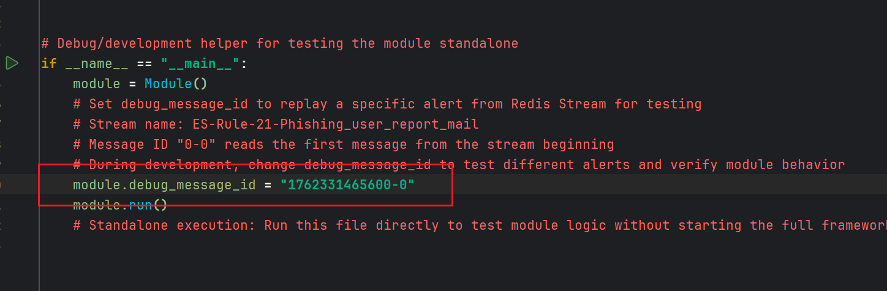

# ES-Rule-21-Phishing_user_report_mail

## 导入测试告警

ASF提供的样例模块都包含用于测试的告警数据,位于 `DATA/{模块名}/mock_alert.py`,执行该脚本即可将测试告警数据导入 Redis Stream 中.

## 单模块 & 单告警调试

- 模块开发过程中开发人员经常需要针对某条特定告警进行调试.
- ASF 框架可以单独调试模块,无需启动整个框架.代码可参考该模块```if __name__ == "__main__":```部分.

- 开发人员只需要在 Redis Insight 中找到模块对应的 Stream 队列,获取某条告警的ID.


- 然后将 ID 赋值给 `module.debug_message_id` 变量并运行模块脚本调试该告警.



## 告警聚合 (SIRP)

[GroupRule](https://github.com/FunnyWolf/ai-soc-framework/blob/master/Lib/grouprule.py) 类用于告警聚合,将多个Alert按照Rule聚合为一个Case,使用方法参考代码注释.

### 场景一

- SIEM 平台中规则`ES-Rule-21-Phishing_user_report_mail`会将所有用户上报的钓鱼邮件元数据作为告警发送到Redis Stream中
- ASF 模块 `ES-Rule-21-Phishing_user_report_mail` 使用 Langgraph 构建的 AI Agent 分析每条告警,确认是否为钓鱼邮件,并格式化为 SIRP Alert 的格式.
- 我们希望将同一发送者在24h内上报的所有钓鱼邮件聚合为一条 SIRP Case.

```python
rule = GroupRule(
    rule_id=self.module_name,
    rule_name=rule_name,
    deduplication_fields=["mail_from"],
    deduplication_window="24h",
    source="Email",
    workbook=workbook)
```

- deduplication_fields表示以该Alert的那个Artifact作为聚合依据(这里发件人)
- deduplication_window表示多长时间内的Alert进行聚合(这里24h)
- 经过聚合即使攻击者的一个邮件向多个用户发送,也只会在SIRP中生成一条Case,减少分析师工作量.
- 因为所有的相关信息都会被添加到该Case中,分析师和AI Agent可以方便的获取所有数据.

### 场景二

- SIEM平台中规则`NDR-Rule-05-Suspect-C2-Communication` 将所有疑似C2通信的网络流量作为告警发送到Redis Stream中.
- ASF 模块 `NDR-Rule-05-Suspect-C2-Communication` 使用 Langgraph 构建的 AI Agent 分析每条告警,确认是否为疑似C2通信,并格式化为 SIRP Alert 的格式.
- 我们希望将同一主机的疑似C2通信在1小时内的所有告警聚合为一条 SIRP Case.

```python
rule = GroupRule(
    rule_id=self.module_name,
    rule_name=rule_name,
    deduplication_fields=["hostname"],
    deduplication_window="1h",
    source="NDR",
    workbook=workbook
)
```

分析师和汇总分析类的AI Agent应该处理Alert集合(Case),而不是单个Alert,这样可以大大提升分析效率.