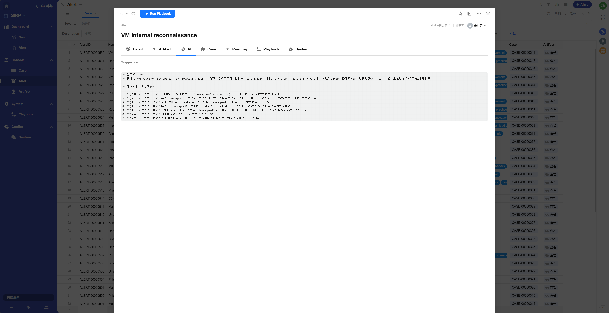

# Alert Analysis Agent

## Registered Name

```
Alert Analysis Agent
```

## Playbook File

```
PLAYBOOK/Alert_Analysis_Agent.py
```

## Function Introduction

- A template example of a SIRP playbook, demonstrating in detail how to develop SIRP playbooks.
- Suitable for developing SIRP playbooks based on basic templates.
- Summarize and analyze alerts to generate suggestions.

## Execution Effect



## Development Guide

- It is recommended to develop different playbooks for different types of alerts to better adapt to the analysis needs of various alert types.