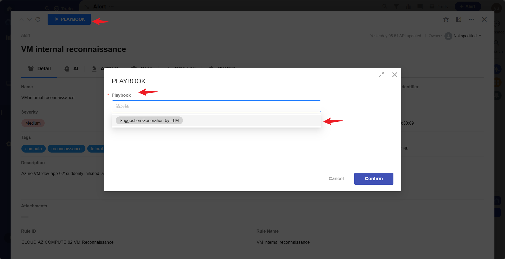

# Alert_Suggestion_Gen_By_LLM

Alert_Suggestion_Gen_By_LLM is a template example of a SIRP playbook, demonstrating in detail how to develop a SIRP playbook.

## Preparation

- First, confirm which data type the playbook is for (Alert/Case/Artifact, etc.).
- Create a new playbook file or copy and rename an existing one.

## Getting Input Parameters

- Each playbook is bound to a data type. When the playbook is executed, the corresponding worksheet and rowId (which can be understood as the database table and primary key ID) of that data type will be passed in. During the execution of the playbook, a complete piece of data can be obtained through the interface.
- Associated data of the data record can also be obtained through the interface. For example, you can get the list of Alerts associated with a Case through the Case's rowId. For each Alert in the Alerts list, you can also get the Artifact list through the interface.
- Refer to the `preprocess_node` node code for the implementation.
- **The advantage of this method is that the user does not need to enter parameters when executing the playbook; the playbook can obtain all the required data through the interface.**
- Code to get worksheet/rowId/user/playbook_rowid:

```python
self.param("worksheet")
self.param("rowid")
self.param("user")
self.param("playbook_rowid")
```

## Updating Task Results and Sending Notifications

- Every time SIRP executes a playbook, it creates a record in the Playbook worksheet.


- It is recommended to update the task result with the following code after each execution:

```python
from PLUGINS.SIRP.sirpapi import Playbook as SIRPPlaybook
SIRPPlaybook.update_status_and_remark(self.param("playbook_rowid"), "Success", "Get suggestion by ai agent completed.")  # Success/Failed 
```

- It is recommended to send a notification to the user who executed the script via Notice.send after completion.

```python
from PLUGINS.SIRP.sirpapi import Notice
Notice.send(self.param("user"), "Alert_Suggestion_Gen_By_LLM output_node Finish", f"rowid：{self.param('rowid')}")
```


## SIRP Registration

- Playbooks applied to SIRP need a category label (CASE/ALERT/ARTIFACT) and a human-readable name to make it easy for users to select and execute the playbook in the SIRP interface.

- The class variables `TYPE` and `NAME` are used in the playbook for registration.

```python

class Playbook(LanggraphPlaybook):
    RUN_AS_JOB = True  # Asynchronous module
    TYPE = "ALERT"  # Category label
    NAME = "Suggestion Generation by LLM"  # Playbook name
```

- After the playbook is written, you need to add the playbook name to the corresponding option set in SIRP. `playbook_artifact`, `playbook_alert`, and `playbook_case` correspond to Artifact/Alert/Case type playbooks respectively.


- After adding, open the corresponding record in SIRP, and click the `Playbook` button to select the newly added playbook for execution.


> Select an Alert record


> Select the playbook and execute

- The execution status of the playbook task can be viewed in `Playbook`.


## Playbook Debugging

- Each playbook file is a separate `Playbook` class that can be executed directly for development and debugging.
- For example, the `Alert_Suggestion_Gen_By_LLM` playbook is applied to an `Alert` record.

```python
if __name__ == "__main__":
    params_debug = {'rowid': '55639caf-c648-4130-bc9f-8d38becfe20f', 'worksheet': 'alert'}
    module = Playbook()
    module._params = params_debug
    module.run()
```

- The `rowid` can be obtained as shown in the figure below:

