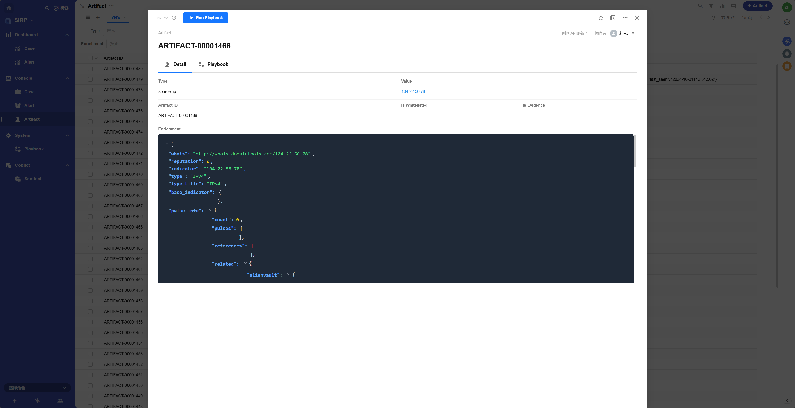

# Threat Intelligence Query (AlienVaultOTX)

## Registered Name

```
TI Enrichment By AlienVaultOTX
```

## Playbook File

```
PLAYBOOK/Artifact_TI_Enrichment_By_AlienVaultOTX.py
```

## Function Introduction

- Introduces how to develop SIRP playbooks for enriching artifacts with threat intelligence using the AlienVault OTX plugin.
- Calls the AlienVaultOTX plugin interface to update artifact enrichment.

## Execution Effect



## Development Guide

- It is recommended to develop different playbooks for different types of alerts to better adapt to the analysis needs of various alert types.