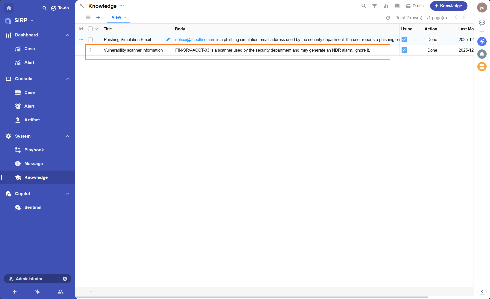
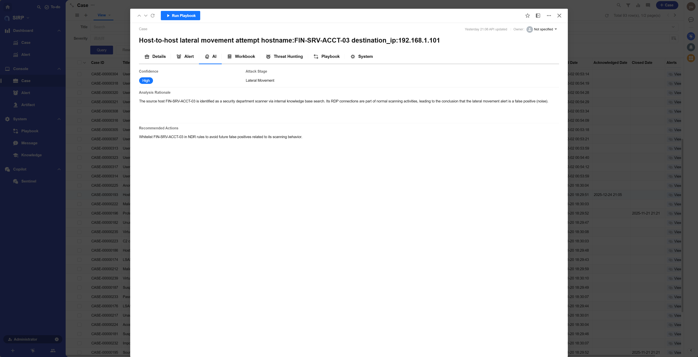

# SOC L3 Analyst Agent (Tool Calling)

## Registered Name

```
L3 SOC Analyst Agent With Tools
```

## Playbook File

```
PLAYBOOK/Case_L3_SOC_Analyst_Agent_With_Tools.py
```

## Features

- Calls the Agent to analyze security tickets, generating AI-related fields for the Case, assisting L3 SOC analysts in threat hunting and response.
- Summarizes and analyzes the Case to generate Case Severity/Confidence/Attack Stage/Analysis Rationale/Recommended Actions.
- Calls the [Knowledge Base](../../../sirp/Feature/knowledge/) for supplementary analysis to improve analysis accuracy.

## Execution Effect

### Knowledge Base Example

For example, the knowledge base stores the following entries:



Effect after calling this playbook:



## Development Guide

- The code of this playbook can be used to develop modules for automated analysis each time a new alert is mounted to a Case.