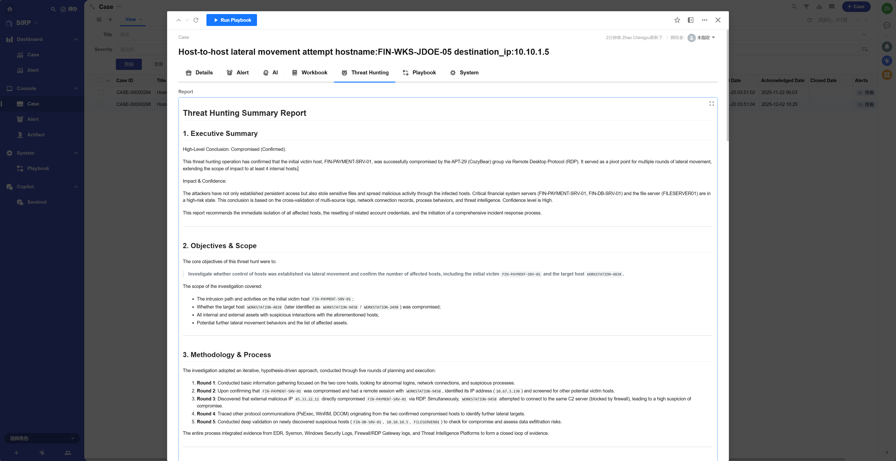

# Threat Hunting Agent

## Registered Name

```
Threat Hunting Agent
```

## Playbook File

```
PLAYBOOK/Case_Threat_Hunting_Agent.py
```

## Function Introduction

A general-purpose threat hunting agent that executes threat hunting tasks and outputs threat hunting reports based on Case-related information and user intent.


## Execution Effect




## Development Guide

- For data queries and operations of external tools (SIEM/CMDB/TI platforms, etc.), refer to the `analyst_node` tool binding section.

```python
base_llm = llm_api.get_model(tag=["powerful", "function_calling"])
llm_with_tools = base_llm.bind_tools([SIEMAgent.search, CMDBAgent.query_asset, TIAgent.lookup])
response = llm_with_tools.invoke(messages)
```

- The current agent is general-purpose and can perform threat hunting for any type of Case. If customized threat hunting is required for specific Case types, the `Planner_System.md` file can be modified to adjust the agent's planning logic and execution steps.
- If a fixed report format is required, `Report_System.md` can be modified.
