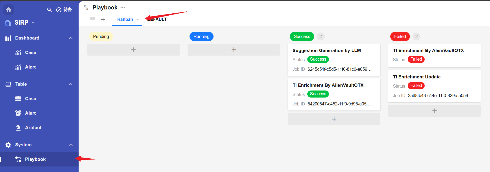
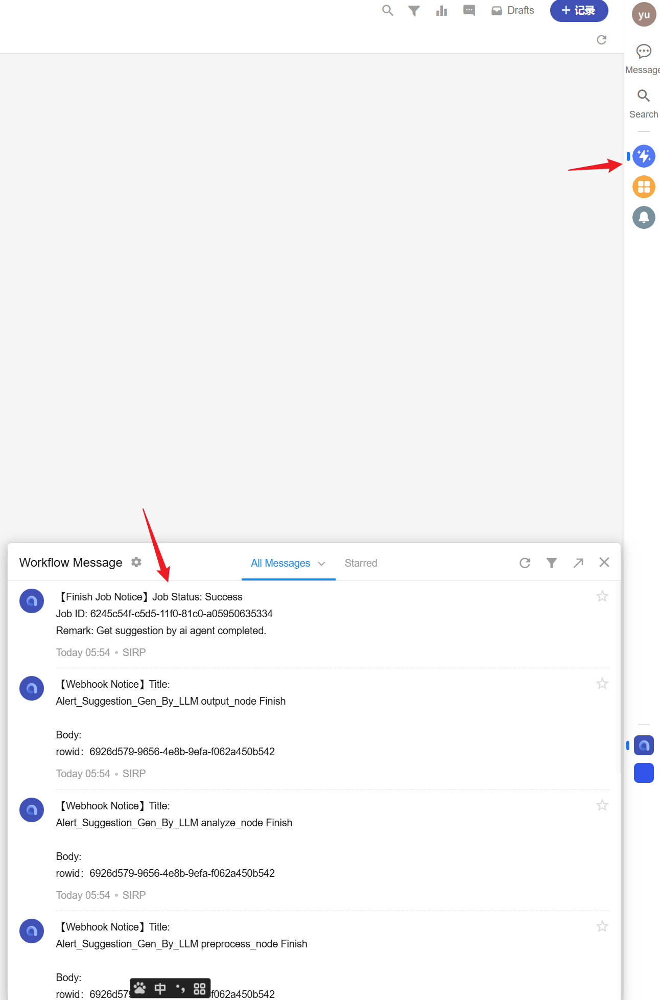

# SIRP Playbook Development Guide

Alert_Suggestion_Gen_By_LLM is a template example of a SIRP playbook, used to illustrate how to develop SIRP playbooks.

## Preparation

- First, confirm the data type for which the playbook will be used (Alert/Case/Artifact, etc.).
- Create a new playbook file or copy and rename an existing one.

## Obtaining Input Parameters

- Each playbook is bound to a data type. When the playbook is executed, the corresponding worksheet and rowId (can be understood as database table and primary key ID) for that data type are passed in. The playbook can obtain a complete data record through an interface during execution.
- Related data records can also be obtained through the interface. For example, using the Case's rowId to get a list of Alerts associated with that Case. Each Alert in the Alerts list can also obtain an Artifact list through the interface.
- Refer to the `preprocess_node` node code for implementation.
- **The advantage of this method is that users do not need to enter parameters when executing the playbook, as the playbook can obtain all required data through the interface.**
- Code to obtain worksheet/rowId/user/playbook_rowid:

```python
self.param("worksheet")
self.param("rowid")
self.param("user")
self.param("playbook_rowid")
```

## Updating Task Results and Sending Notifications

- Each time SIRP executes a playbook, it creates a record in the Playbook's worksheet.



- It is recommended to update the task result with the following code after each execution:

```python
from PLUGINS.SIRP.sirpapi import Playbook as SIRPPlaybook
SIRPPlaybook.update_status_and_remark(self.param("playbook_rowid"), "Success", "Get suggestion by ai agent completed.")  # Success/Failed
```

- It is recommended to send a notification to the user who executed the script via Notice.send after execution:

```python
from PLUGINS.SIRP.sirpapi import Notice
Notice.send(self.param("user"), "Alert_Suggestion_Gen_By_LLM output_node Finish", f"rowid：{self.param('rowid')}")
```



## SIRP Registration

- Playbooks applied in SIRP require a classification tag (CASE/ALERT/ARTIFACT) and a human-readable name, to facilitate users in selecting and executing playbooks within the SIRP interface.

- Playbooks use the two class variables TYPE and NAME for registration.

```python

class Playbook(LanggraphPlaybook):
    RUN_AS_JOB = True  # Asynchronous module
    TYPE = "ALERT"  # Classification tag
    NAME = "Suggestion Generation by LLM"  # Playbook name
```

- After the playbook is written, its name needs to be added to the corresponding option set in SIRP. `playbook_artifact`, `playbook_alert`, and `playbook_case` correspond to Artifact/Alert/Case type playbooks, respectively.


- After adding, open the corresponding record in SIRP, click the `Playbook` button to select and execute the newly added playbook.


> Select an Alert record


> Select playbook and execute

- The playbook task execution status can be viewed in `Playbook`.


## Playbook Debugging

- Each playbook file is a standalone `Playbook` class and can be executed directly for development and debugging.
- For example, the `Alert_Suggestion_Gen_By_LLM` playbook is applied to an `Alert` record.

```python
if __name__ == "__main__":
    params_debug = {'rowid': '55639caf-c648-4130-bc9f-8d38becfe20f', 'worksheet': 'alert'}
    module = Playbook()
    module._params = params_debug
    module.run()
```

- The `rowid` can be obtained as shown in the figure below:


