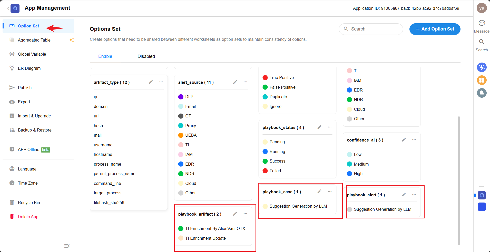
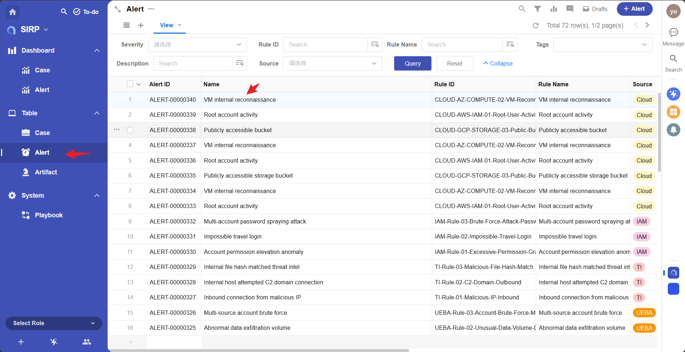
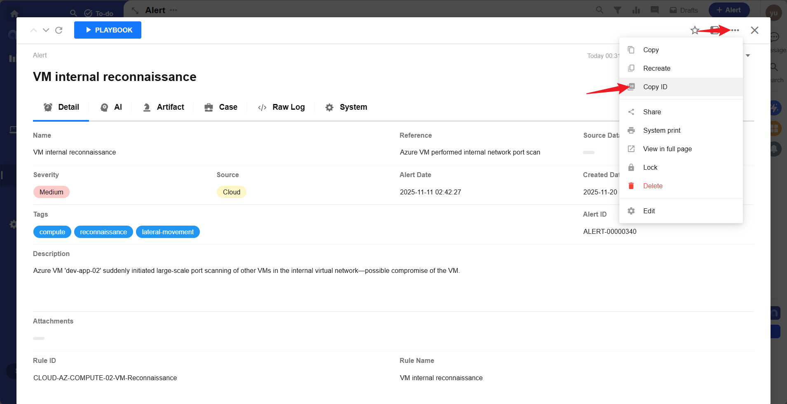

# Development Guide

Playbooks are used to execute **user-triggered** automated tasks.

For example:

- Calling TI to query and update Artifact enrichment,
- Analyzing Alerts to generate Suggestions,
- Performing threat hunting for Cases.

`Alert_Analysis_Agent` is a template example of a SIRP playbook, which will be used to introduce how to develop SIRP playbooks.

## Registering Playbooks

- First, confirm the data type the playbook will be used for (Alert/Case/Artifact, etc.).
- Create the playbook script file in the `PLAYBOOKS` directory.
- Ensure the class name is `Playbook` and it inherits from `BasePlaybook` or `LanggraphPlaybook`.
- Implement the `run` function; the framework will automatically execute this function.
- **The recommended method is to copy an existing script and modify it as needed.**

## Getting Input Parameters

- Each playbook is bound to a data type. When the playbook is executed, the corresponding worksheet and rowid (can be understood as database table and primary key ID) for that data type will be passed in. The playbook can obtain a complete data record through an interface during execution.
- Related data records can also be obtained through the interface. For example, by using the Case's rowid, a list of Alerts associated with that Case can be retrieved. Each Alert in the Alerts list can also retrieve its Artifact list through the interface.
- The implementation code can refer to the `preprocess_node` node code.
- **The advantage of this method is that users do not need to input parameters when executing the playbook; the playbook can obtain all required data through the interface.**
- Code for getting input parameters:

```python
@property
def param_rowid(self):
    return self.param("rowid")

@property
def param_source_rowid(self):
    return self.param("source_rowid")

@property
def param_source_worksheet(self):
    return self.param("source_worksheet")

@property
def param_user(self):
    return self.param("user")

@property
def param_user_input(self):
    return self.param("user_input")
```

## Updating Task Results and Sending Notifications

- SIRP creates a record in the Playbook's worksheet every time a playbook is executed.


- It is recommended to update the task result after each execution using the following code:

```python
self.update_playbook("Success", "Get suggestion by ai agent completed.") # Success/Failed
```

- It is recommended to send a notification to the user who executed the script via `send_notice` after execution:

```python
self.send_notice("Alert_Suggestion_Gen_By_LLM output_node Finish", f"rowid:{self.param_source_rowid}")
```


## SIRP Registration

- Playbooks applied to SIRP require a classification tag (CASE/ALERT/ARTIFACT) and a human-readable name to facilitate users in selecting and executing playbooks in the SIRP interface.

- Playbooks use `TYPE` and `NAME` as two class variables for registration.

```python

class Playbook(LanggraphPlaybook):
    TYPE = "ALERT"  # Classification tag
    NAME = "Suggestion Generation by LLM"  # Playbook name
```

- After writing the playbook, its name needs to be added to the corresponding option set in SIRP. `playbook_artifact`, `playbook_alert`, and `playbook_case` correspond to Artifact, Alert, and Case type playbooks, respectively.




- After adding, open the corresponding record in SIRP, and click the `Playbook` button to select and execute the newly added playbook.

- Select an Alert record
  

- Select and execute the playbook


- The playbook task execution status can be viewed in `Playbook`.


## Playbook Debugging

- Each playbook file is a separate `Playbook` class and can be directly executed for development and debugging.
- For example, the `Alert_Suggestion_Gen_By_LLM` playbook is applied to an `Alert` record.

```python
if __name__ == "__main__":
    params_debug = {'source_rowid': '13782e0a-2423-4fc3-9b16-7f2eb15ae83f', 'source_worksheet': 'alert'}
    module = Playbook()
    module._params = params_debug
    module.run()
```

- Where `source_rowid` can be obtained by the method shown in the figure below:


