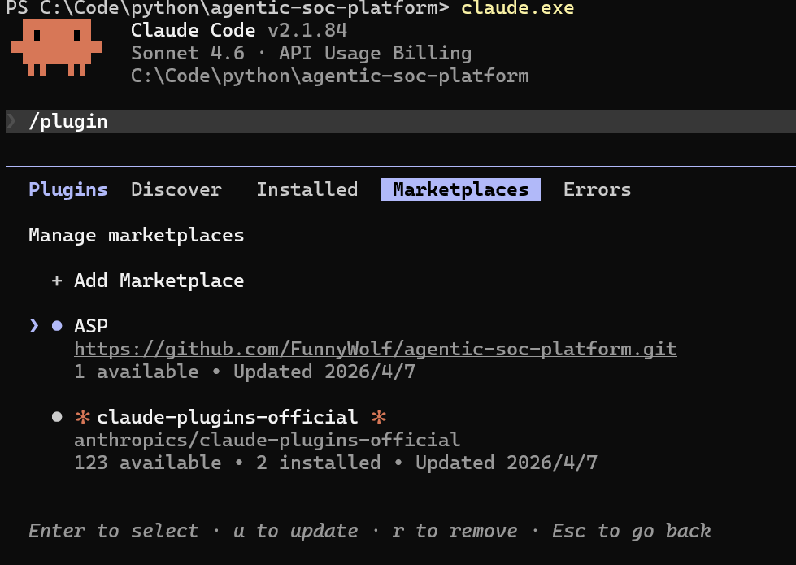
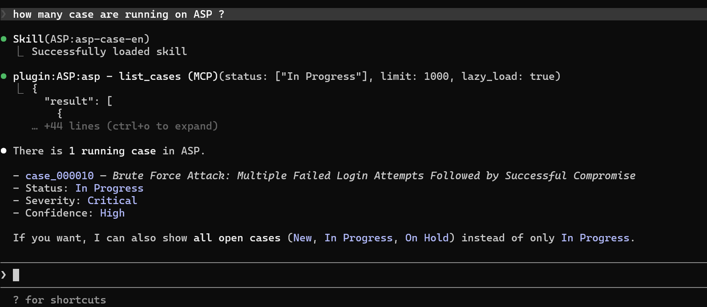

# Claude Code Plugin

## Features

- Two agents: asp-case-investigator / asp-artifact-investigator
- Eight skills: alert / artifact / case / enrichment / knowledge / playbook / SIEM / ticket
- Connects to the ASP MCP server by default

## Configuration

- First start the ASP MCP service and obtain the MCP SSE URL from the [documentation](../MCP/)
- Set the URL in the ASP_MCP_SSE_URL environment variable

PowerShell:
```powershell
$env:ASP_MCP_SSE_URL = "http://your_server_ip:7000/XXXXXXXXXXXXX/sse"
```

Bash:
```bash
export ASP_MCP_SSE_URL="http://your_server_ip:7000/XXXXXXXXXXXXX/sse"
```

- Start Claude Code, add the https://github.com/FunnyWolf/agentic-soc-platform marketplace, and install the asp plugin




## Using Skills / Agents

