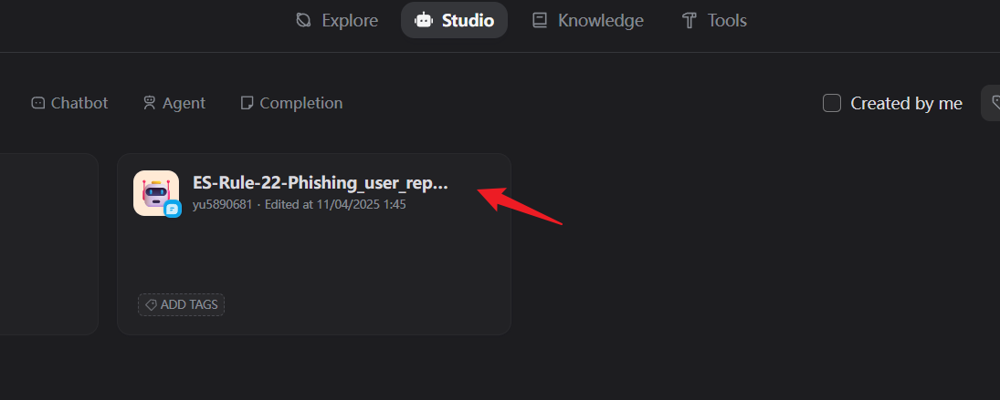
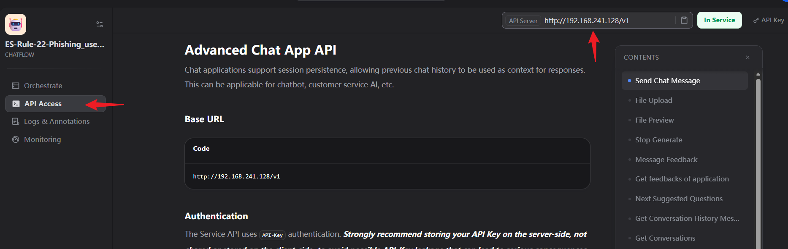
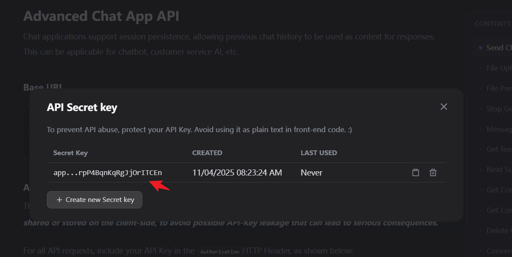

# Dify Plugin

## Configuration Method

- Rename the configuration file agentic-soc-platform/PLUGINS/Dify/CONFIG.example.py to CONFIG.py to apply the configuration.
- How to get DIFY_BASE_URL




- DIFY_API_KEY is configured according to each application name.




## Naming Convention

It is generally recommended that the application name in Dify be the same as the name of the Module/Playbook called in ASP. In ASP, you can use the following code to quickly call the corresponding application:

```python
client = Dify()
# Get the corresponding api_key directly through module_name or playbook_name
# api_key is directly bound to the Dify application
api_key = client.get_dify_api_key(self.module_name)
inputs = {
    "alert_raw": json.dumps(self.agent_state.alert_raw)
}

result = client.run_workflow(
    api_key=api_key,
    inputs=inputs,
    user=self.module_name
)
self.agent_state.analyze_result = result.get("analyze_result")
return
```
