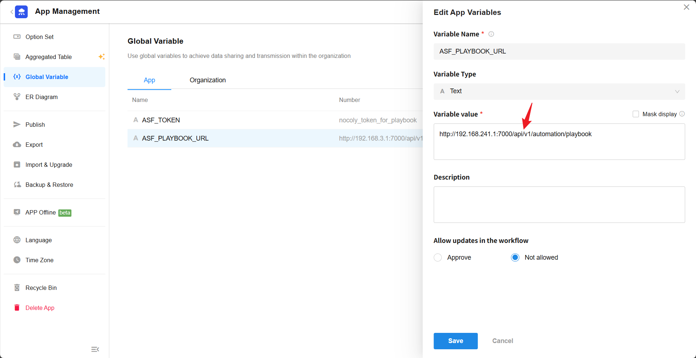

# SIRP Plugin

## Set Global Variables

> Used for ASF's REST API authentication, must be consistent with ASF_TOKEN in the ai-soc-framework/CONFIG.py file.

> Used to call the ASF Playbook interface, please modify the IP according to your actual configuration.

## Configuration Method

- Rename the configuration file ai-soc-framework/PLUGINS/SIRP/CONFIG.example.py to CONFIG.py to apply the configuration.
- SIRP_URL is the SIRP platform address, e.g., http://192.168.241.128:8880
- SIRP_APPKEY and SIRP_SIGN

> AppKey corresponds to SIRP_APPKEY, Sign corresponds to SIRP_SIGN.

- SIRP_NOTICE_WEBHOOK

> Configure the notification Webhook address to SIRP_NOTICE_WEBHOOK.
