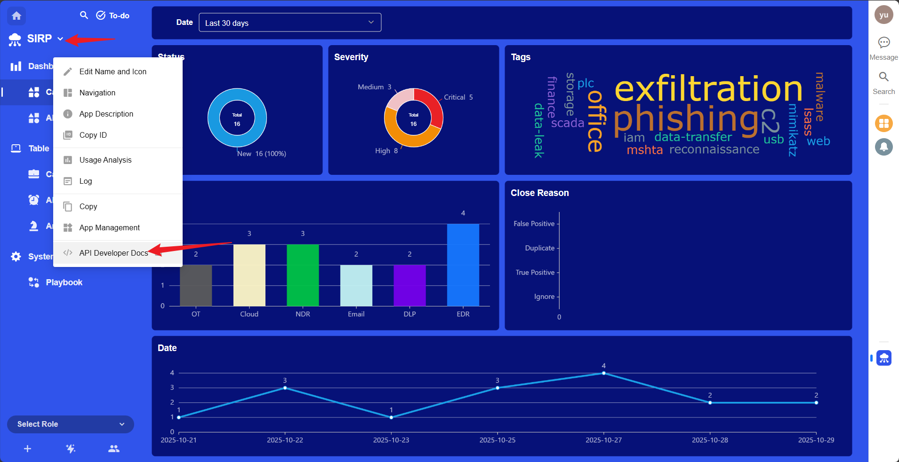

# SIRP Plugin

## Deployment

[SIRP Installation Guide](../../../sirp/Deploy/sirp_install/)

## Plugin Configuration

- Rename the configuration file agentic-soc-platform/PLUGINS/SIRP/CONFIG.example.py to CONFIG.py to enable the configuration.
- `SIRP_URL` is the SIRP platform address, such as http://192.168.241.128:8880 (private deployment) or https://www.nocoly.com (cloud service).
- `AppKey` corresponds to `SIRP_APPKEY`, and `Sign` corresponds to `SIRP_SIGN`.

- Fill in the notification Webhook address into `SIRP_NOTICE_WEBHOOK`.

