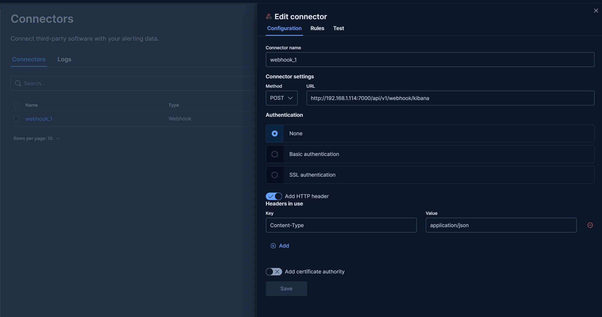
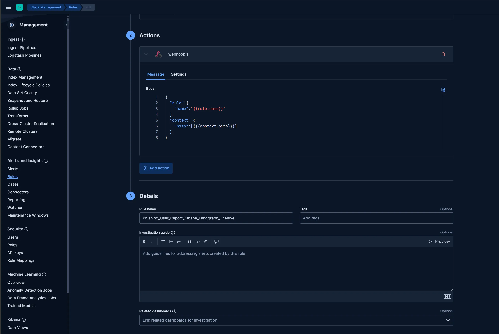

# SIEM Integration

## Webhook Forwarder

- ASP has a built-in Forwarder plugin that forwards alerts sent by SIEM Webhooks to the corresponding Redis Stack Stream.
- The Forwarder automatically parses alert names in Kibana/Splunk and creates a Stream with the same name in Redis Stack based on the alert name.
- Forwarder documentation [Forwarder](../../PLUGINS/Forwarder/)
- The URL format for the Forwarder is:

```http://<ASF_SERVER_IP>:<ASF_SERVER_PORT>/api/v1/webhook/<SIEM_NAME>```

- `<SIEM_NAME>` supports `kibana` and `splunk`

- For ease of integration, the Forwarder Webhook does not require authentication and access control can be done via a firewall.

## Splunk Integration

- The SOC team first needs to integrate security devices or related system logs into Splunk according to their own needs and create alerts according to business requirements.

  

- For triggering, select `each result` to ensure all alerts are obtained.
- The Webhook link is `http://<ASF_SERVER_IP>:<ASF_SERVER_PORT>/api/v1/webhook/splunk`
- The Forwarder will automatically forward the alert to the corresponding Stream in Redis Stack, and the Stream name will be the alert name.
- For example, the alert in the image above will be forwarded to the `Phishing_user_Report_Dify_Nocodb` queue in Redis Stream.


- Create a `Phishing_user_Report_Dify_Nocodb.py` module in `MODULE` to handle this alert.
- The original content of Splunk alerts is usually stored in the `_raw` field. The Forwarder will process the content of this field as the main information of the alert. When parsing alerts in the module, the following code is typically used:

```python
alert = self.read_message()
if alert is None:
    return

# Example: For Splunk webhooks
alert = json.loads(alert["_raw"])
```

## Kibana (ELK) Integration

- The SOC team first needs to integrate security devices or related system logs into ELK according to their own needs and create Rules according to business requirements.
- Create `Webhook Connectors` with `Authentication` as `None`, and add the `header` `Content-Type: application/json`.
- The Webhook URL is `http://<ASF_SERVER_IP>:<ASF_SERVER_PORT>/api/v1/webhook/kibana`

  

- In Kibana, for each Rule, select the `Webhook Connectors` created above for `Action`.
- The `Message` content uses the following JSON template (context.hits contains the documents filtered by the alert, i.e., raw logs):

```
{
  "rule":{
    "name":"{{rule.name}}"
  },
  "context":{
    "hits":[{{{context.hits}}}]
  }
}
```

- In `Details`, `Rule name` will be used as the alert name. The Forwarder will forward the alert to the corresponding Stream in Redis Stack, and the Stream name will be the alert name.



- For example, the alert in the image above will be forwarded to the `Phishing_User_Report_Kibana_Langgraph_Thehive` queue in Redis Stream.


- Create a `Phishing_User_Report_Kibana_Langgraph_Thehive.py` module in `MODULE` to handle this alert.