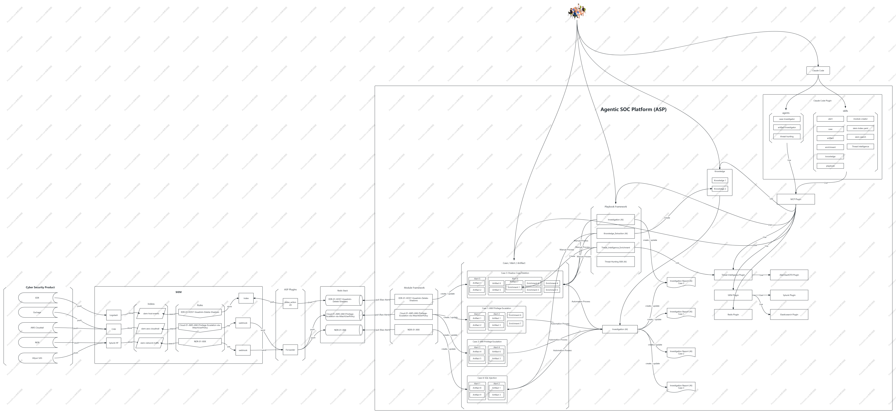

# Agentic SOC Platform

ASP is an open-source security operations platform that provides security teams with a complete workflow from alert ingestion, automatic aggregation, and AI analysis to response and remediation.

Unlike traditional SIEM/SOAR, the AI Agents in ASP are not just auxiliary tools -- they actively participate in alert triage, case investigation, and knowledge accumulation. The analyst's role shifts from "processing alerts one by one" to "reviewing AI reports and making decisions."

## Core Capabilities

**Automated Alert Processing**
The Module framework continuously consumes SIEM alerts, automatically extracts IOCs, correlates and aggregates them, and transforms raw logs into a structured three-tier system of Case / Alert / Artifact.

**AI-Powered Investigation, Seconds Not Hours**
Built-in LLM analysis pipeline compresses hours of manual analysis into seconds, auto-generating reports with verdicts, attack chains, IOCs, and remediation advice.

**Automated Playbooks**
Playbooks support one-click triggering: in-depth case investigation, extracting knowledge from processed cases, and attaching threat intelligence enrichment to Artifacts. Custom extensions based on Python.

**Harness Agent Integration**
Deep integration with Claude Code through the MCP protocol, providing professional security Agents and Skills. Analysts can directly operate Cases, search SIEM logs, query threat intelligence, and write Modules and Playbooks within the AI Agent.

**Continuous Knowledge Accumulation**
Automatically extracts reusable security knowledge from closed cases, continuously building an organization-level knowledge base to improve the efficiency and accuracy of subsequent case analysis.

**Flexible Customization**
Modules, plugins, and Playbooks are all Python scripts. Simply follow the conventions to integrate new SIEM rules, threat intelligence sources, or automation workflows. The built-in SIRP frontend supports UI, data model, and workflow customization.

**On-Premises Deployment**
Fully deployed locally, data stays within the internal network. Licensed under the MIT open-source license.

## Architecture

## Getting Started

- [Environment Setup](../../Development/environment_setup/) -- Quickly deploy ASP
- [Module Development](../../MODULES/development/) -- Write alert processing modules
- [Playbook Development](../../PLAYBOOKS/development/) -- Write automated Playbooks
- [SIRP Platform](../../../sirp/Introduction/what_is_sirp/) -- Learn about the built-in frontend application

## License

[MIT](https://github.com/FunnyWolf/agentic-soc-platform/blob/master/LICENSE) open-source license.
