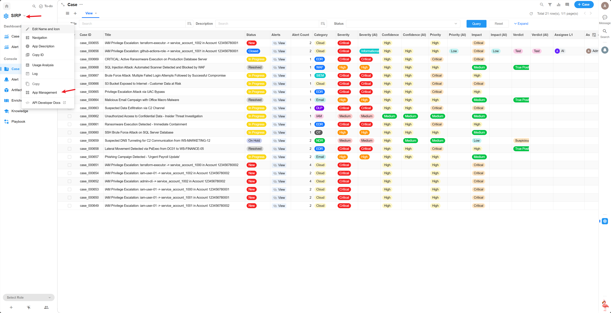
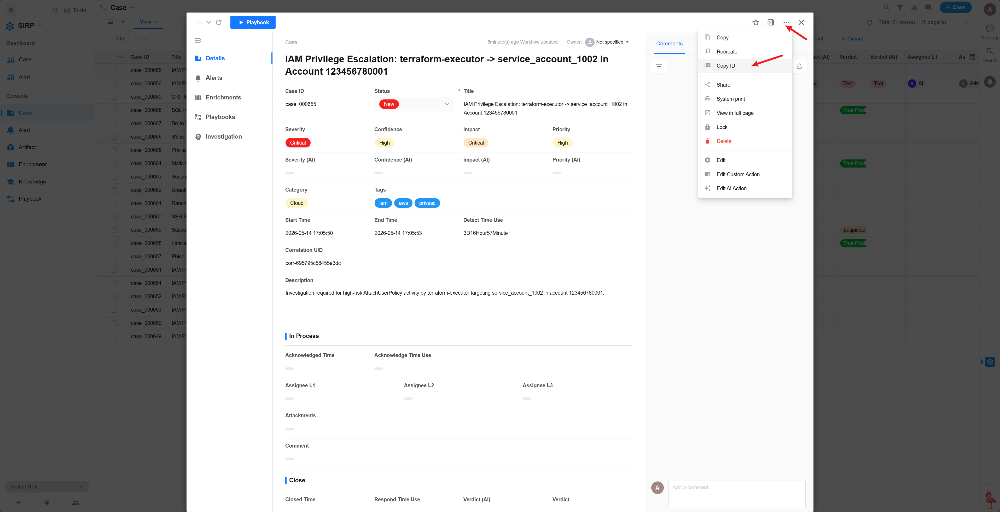

# Development Guide

Playbooks are used to execute **user-triggered** automated tasks, such as:

- Calling LLM to analyze a Case and generate a report ([Investigation](../Investigation/index.md))
- Analyzing the process and results of closed Cases to generate Knowledge ([Knowledge Extraction](../Knowledge_Extraction/index.md))
- Adding threat intelligence enrichment to all Artifacts associated with a Case ([Threat Intelligence Enrichment](../Threat_Intelligence_Enrichment/index.md))

[Investigation](../Investigation/index.md) can serve as an example demonstrating the usage of key Playbook APIs.

## Registering a Playbook

- Playbooks only operate on Cases — only Cases can run Playbooks
- Create a script file under the `PLAYBOOKS` directory
- The class name must be `Playbook`, inheriting from `BasePlaybook` or `LanggraphPlaybook`
- The class must contain `NAME = "XXX"`, which serves as the registration name in SIRP
- Implement the `run` method, which will be called automatically by the framework
- **Recommended: copy an existing script and modify as needed**

## Retrieving Input Parameters

- `self.param_source_row_id` — The row_id of the Case that triggered the Playbook, which can be used to call Case-related APIs (e.g., retrieve associated Alert lists, and then retrieve Artifact lists for each Alert)
- `self.param_user_input` — Additional user input at execution time (optional)
- During Playbook execution, Case / Alert / Artifact can be updated via API

## Updating Task Results

After execution completes, update the task status with the following code:

```python
self.update_playbook_status(PlaybookJobStatus.SUCCESS, "Case Investigation Success.")  # SUCCESS/FAILED
```

## SIRP Registration

Playbooks must be registered in SIRP before they can be selected for execution in the UI.

Add the Playbook's `NAME` value to SIRP's `PLAYBOOK` option set:




Once registered, click the `Playbook` button on the Case detail page to select and execute.

## Playbook Debugging

Each Playbook file is an independent `Playbook` class that can be run directly for debugging. Using `Investigation` as an example:

```python
if __name__ == "__main__":
    import os, django
    os.environ.setdefault("DJANGO_SETTINGS_MODULE", "ASP.settings")
    django.setup()
    model = PlaybookModel(source_row_id='your_case_row_id_here')
    module = Playbook()
    module._playbook_model = model
    module.run()
```

The `source_row_id` can be obtained from the Case detail page in SIRP:


