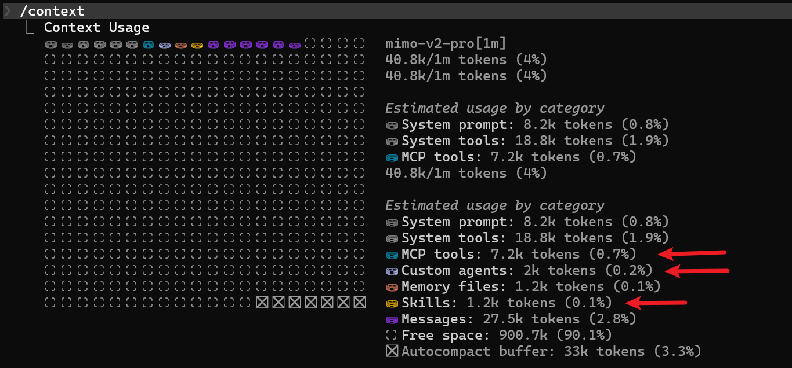
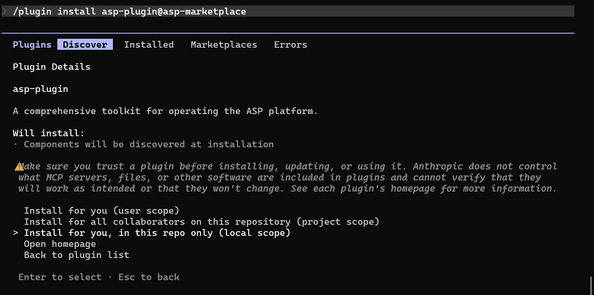

# Claude Code Plugin

## Feature List

- **3 Agents**
    - `asp-case-investigator` — Case-driven security investigation, triage, and evidence assessment
    - `asp-artifact-investigator` — IOC/artifact-driven investigation, threat hunting, and scope determination
    - `asp-threat-hunting` — Proactive threat hunting and hypothesis-driven security investigation

- **10 Skills**
    - `asp-alert` — View alerts and perform triage analysis
    - `asp-artifact` — Find artifacts by IOC
    - `asp-case` — Manage security cases, including review, discussion, workflow, and AI analysis
    - `asp-enrichment` — Save structured data as enrichment and attach to case/alert/artifact
    - `asp-knowledge` — Knowledge record retrieval and maintenance, supporting semantic search
    - `asp-module-creator` — Write alert processing Python scripts for SIEM rules
    - `asp-playbook` — Operate playbook definitions and playbook runs, view, execute, or review
    - `asp-siem-index-yaml` — Create or update SIEM index configuration YAML
    - `asp-siem-search` — Perform log investigation, event retrieval, and structured analysis in SIEM
    - `asp-threat-intelligence` — Query threat intelligence for IOCs and assess risk levels

- Connects to ASP MCP Server

## Configuration

- Configure the [MCP Plugin](../MCP/index.md) to obtain the MCP SSE URL
- Set the URL in the environment variable ASP_MCP_SSE_URL

PowerShell:

```powershell
$env:ASP_MCP_SSE_URL = "http://your_server_ip:7001/XXXXXXXXXXXXX/sse"
```

Bash:

```bash
export ASP_MCP_SSE_URL="http://your_server_ip:7001/XXXXXXXXXXXXX/sse"
```

- Start Claude Code
- Register the https://github.com/FunnyWolf/asp-marketplace marketplace

```
/plugin marketplace add FunnyWolf/asp-marketplace
```

- Install the plugin from the marketplace

```
/plugin install asp-plugin@asp-marketplace
```


## Invoking Skills / Agents


## Additional Notes

- The ASP Plugin occupies approximately 10.5k context for MCP Tools / Agents / Skills when Claude Code starts



- It is recommended to install the plugin to the repo local to reduce context usage when using Claude Code for other projects.


