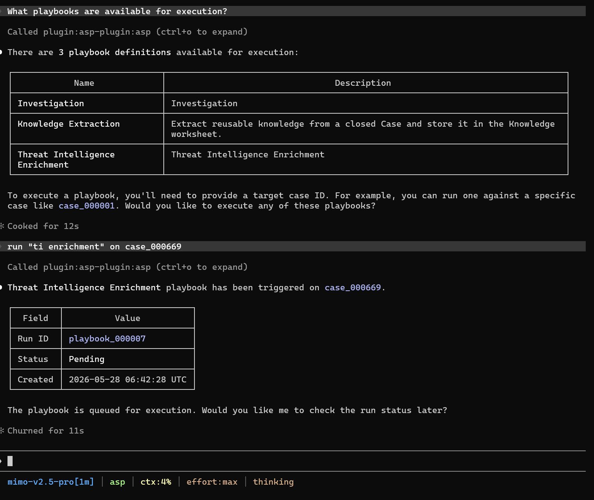

# Playbook

Operate Playbooks: view executable definitions, execute playbooks against Cases, and view execution history.

## Trigger Scenarios

- View which Playbooks are available for execution
- Run an automated playbook against a specific Case
- View Playbook execution records for a Case

## Usage Examples

## Input

| Parameter            | Description                                                               |
|---------------|------------------------------------------------------------------|
| Playbook definition name | Name returned by `list_playbook_definitions`                                |
| case_id       | Target Case ID for execution                                                     |
| user_input    | Optional additional natural language instructions                                                      |
| Filters          | playbook_id, job_status (Pending/Running/Success/Failed), case_id |

## Output

- Definition list: Names of executable Playbooks
- Execution records: Run ID, Case ID, Job Status, definition name, update time

## Dependencies

MCP tools: `list_playbook_definitions`, `execute_playbook`, `list_playbook_runs`.
