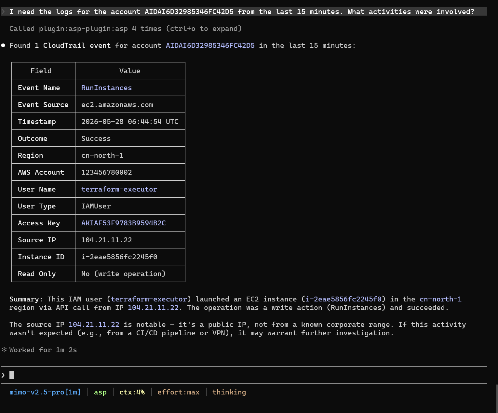

# SIEM Search

SIEM log investigation: index/field exploration, keyword search, and precise filtered queries.

## Trigger Scenarios

- Don't know which index the logs are in and need to explore first
- Search for related logs using IOCs or keywords
- Know the index and fields, need to perform precise filtering and aggregation

## Usage Examples

## Three Modes

| Mode        | Scenario              | MCP Tool                |
|-----------|-----------------|-----------------------|
| Schema Exploration | Unknown index/field structure      | `siem_explore_schema` |
| Keyword Search     | Clues are vague, starting from keywords     | `siem_keyword_search` |
| Precise Query      | Index and fields known, need filtering/aggregation | `siem_adaptive_query` |

### How to Choose

- Clue is a keyword → `siem_keyword_search`
- Known index + known field conditions → `siem_adaptive_query`
- Uncertain about index/fields → use `siem_explore_schema` first

## Input

| Parameter                   | Description                    |
|----------------------|-----------------------|
| keyword              | Keyword or keyword list (list uses AND matching) |
| index_name           | Index name (optional for keyword search, required for precise query)  |
| time_range_start/end | UTC time, ISO8601 format     |
| filters              | Precise field filters (for precise queries)         |
| aggregation_fields   | Aggregation fields (optional)            |

## Output

Search results auto-adjust based on hit count:

- <= 100 records: Complete records
- 100~1000 records: Statistics + 5 samples
- > 1000 records: Statistics only

## Dependencies

MCP tools: `siem_explore_schema`, `siem_keyword_search`, `siem_adaptive_query`, `get_current_time`.
