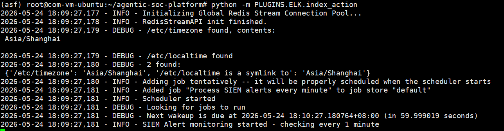

# ELK Plugin

## Features

- Elasticsearch (ELK/Kibana) SIEM client plugin, implemented based on `elasticsearch-py`.
- Provides structured queries, keyword search, field discovery, aggregation analysis, and more (in conjunction with [SIEM Plugin](../SIEM/index.md) YAML index configuration).
- Using Kibana's index action, alerts generated by rules can be sent to a specified index. The index_action.py script can forward alerts from the index to a Redis Stream message queue for module consumption.

> This feature can replace the Forwarder plugin's webhook receiving functionality and is suitable for the ELK community edition.

- Using Kibana's webhook action, alerts generated by rules can be sent to the Forwarder, which then forwards the received alerts to a Redis Stream message queue for module consumption.

## Configuration

- Rename `PLUGINS/ELK/CONFIG.example.py` to `CONFIG.py`
- Fill in the configuration items according to the code comments

```python
ELK_HOST = "https://10.10.10.10:9200"
ELK_KEY = "X0XXXXXX=="

ACTION_INDEX_NAME = "siem-alert"
POLL_INTERVAL_MINUTES = 1
```

| Configuration Item      | Description                               |
|-------------------------|-------------------------------------------|
| ELK_HOST                | Elasticsearch service address              |
| ELK_KEY                 | ELK Personal API key                       |
| ACTION_INDEX_NAME       | Alert index name                           |
| POLL_INTERVAL_MINUTES   | index_action polling interval (minutes)    |

## Sending Alerts to Redis Stream (index action)

- Configure the [Redis Plugin](../Redis/index.md)

> index_action.py needs to read configuration items from the Redis plugin's CONFIG.py; ensure they are correctly configured

- Create a connector


The index can be customized, but must match ACTION_INDEX_NAME in CONFIG.py


- Create an Alert Rule in Kibana


- Set the Action


Message code

```json
{
  "@timestamp": "{{context.date}}",
  "rule": {
    "name": "{{rule.name}}"
  },
  "context": {
    "hits": "[{{context.hits}}]"
  }
}
```

- After the Rule triggers, new alert documents will appear in the siem_alert index.


- Install dependencies and run the index_action.py script to forward alerts to the Redis Stream message queue

```bash
cd ~/agentic-soc-platform
uv sync
python -m PLUGINS.ELK.index_action
```



- Log in to Redis Insight to view alerts in the Stream


## Sending Alerts to Redis Stream (webhook action)

- Configure the [Forwarder Plugin](../Forwarder/index.md)

- Create a connector


The URL is http://192.168.163.128:7000/api/v1/webhook/kibana; replace the IP and port according to your actual environment

- Create an Alert Rule in Kibana


- Set the Action


Message code

```
{
  "rule":{
    "name":"{{rule.name}}"
  },
  "context":{
    "hits":[{{{context.hits}}}]
  }
}
```

- After the Rule triggers, corresponding logs will appear in the Forwarder


- Log in to Redis Insight to view alerts in the Stream


