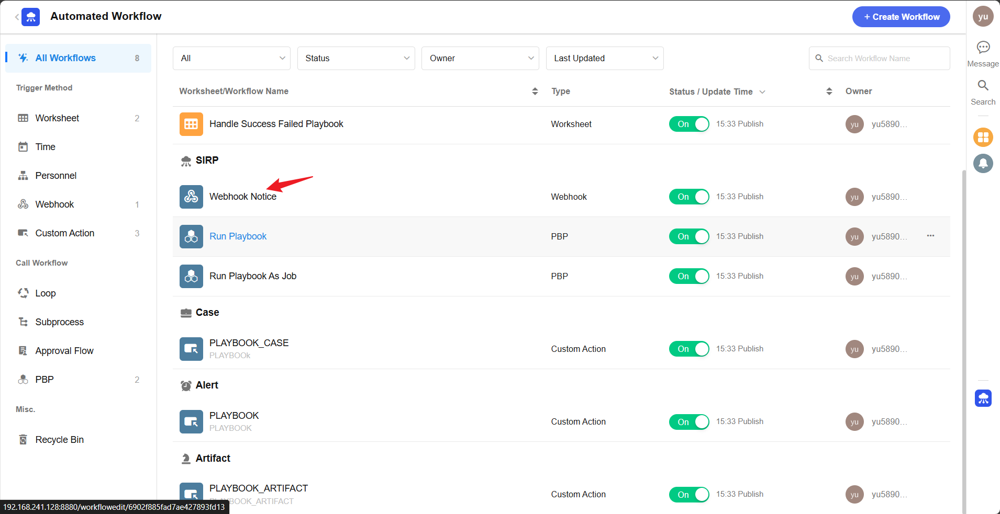
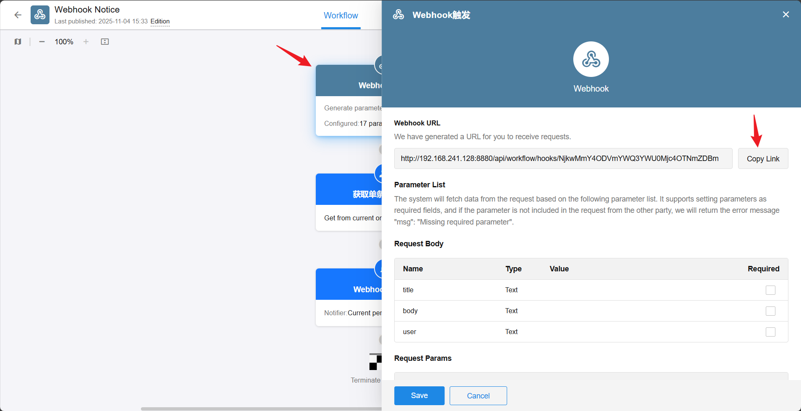

# SIRP Plugin

SIRP (Security Incident Response Platform) is the incident response hub of the platform, implemented based on Nocoly HAP, providing unified management of six entity types: Case, Alert, Artifact, Enrichment, Playbook, and Knowledge.

## Deployment

[SIRP Installation Guide](../../../sirp/Deploy/sirp_install/)

## Configuration

1. Rename `PLUGINS/SIRP/CONFIG.example.py` to `CONFIG.py`
2. Fill in the configuration items:

| Configuration Item | Description |
|--------------------|-------------|
| `SIRP_URL` | SIRP platform address, e.g. `http://192.168.241.128:8880` (private deployment) or `https://www.nocoly.com` (cloud service) |
| `SIRP_APPKEY` | Application key, obtained from the SIRP application management page |
| `SIRP_SIGN` | Application signature, obtained from the SIRP application management page |
| `SIRP_NOTICE_WEBHOOK` | Notification webhook address, used to push messages to users |

 

  

## Core Entities

### Entity Relationships

```
Case ──┬── Alert ──┬── Artifact ── Enrichment
       │           └── Enrichment
       └── Enrichment
```

- **Case**: A security case that aggregates multiple Alerts; the core object for analyst and AI analysis
- **Alert**: An alert mapped from SIEM Rule-generated alerts, including MITRE ATT&CK mapping, risk level, remediation suggestions, etc. An Alert can only be attached to one Case
- **Artifact**: An entity (IOC) extracted from alerts, such as IP, domain, hash, user, etc. An Artifact can be attached to multiple Alerts (many-to-many relationship)
- **Enrichment**: Enrichment data that can be attached at any level of Case / Alert / Artifact, supplementing context such as threat intelligence, CMDB, and geolocation
- **Playbook**: Response playbook execution records, linked to Cases, tracking execution status and results
- **Knowledge**: Knowledge base; internal security knowledge records for AI and analyst queries, supporting automatic extraction from closed Cases

### Key Capabilities

**General CRUD**
All entities support get / list / create / update / update_or_create / batch_update_or_create, with querying by row_id or business ID, and structured filter conditions.

**Automatic Related Data Loading**
When a Case is loaded, associated Alert lists (including Artifacts and Enrichments) are automatically cascaded. When an Alert is loaded, Artifacts and Enrichments are automatically cascaded. No manual join is required.

**Automatic Deduplication**
- Artifact: Deduplicated by the composite key of name + type + role + value; if it already exists upon creation, the existing row_id is returned
- Enrichment: Deduplicated by uid (externally computed stable identifier) or type + provider + value; if it already exists, it is updated
- Artifact values are automatically normalized (email/hash/hostname converted to lowercase, MAC address format standardized)

**Case AI Analysis Scheduling**
Cases support triggering automated AI analysis via `mark_analysis_requested()`, with cooldown scheduling based on Redis Stream (default 10 minutes), supporting debouncing and prioritizing first requests.

**Separation of AI and Manual Assessment**
Cases maintain both manual assessment fields (`severity` / `confidence` / `verdict`) and AI assessment fields (`severity_ai` / `confidence_ai` / `verdict_ai`), which do not overwrite each other.

**AI Investigation Report**
The Case's `investigation_report_ai_json` field stores LLM-generated structured investigation reports, including verdict, attack chain, timeline, IOCs, remediation suggestions, etc.

**Discussion Records**
Cases and Alerts support discussion/comment threads, retrievable via `get_discussions()`.

**Playbook Execution Management**
Playbooks support creating pending execution records, tracking execution status (Pending / Running / Success / Failed), and triggering via Case ID.

**Knowledge Search**
Knowledge supports searching non-expired knowledge records by keyword list (matching title or body), returning formatted results for AI consumption.

**Notification Push**
Notice supports sending notification messages to specified users via Webhook.

**AI Serialization**
All entities support the `model_dump_for_ai(profile=...)` method, filtering fields by profile (e.g. "mcp", "investigation") to generate concise JSON suitable for LLM consumption.
