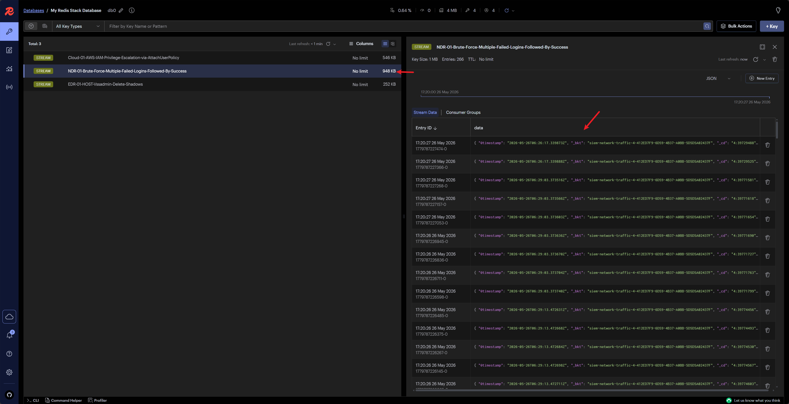

# Splunk Plugin

Splunk SIEM client, implemented based on `splunk-sdk`, providing Splunk backend query capabilities for the SIEM plugin.

## Configuration

1. Rename `PLUGINS/Splunk/CONFIG.example.py` to `CONFIG.py`
2. Fill in the configuration items:

| Configuration Item | Description                                                              |
|--------------------|--------------------------------------------------------------------------|
| `SPLUNK_HOST`      | Splunk server address                                                    |
| `SPLUNK_PORT`      | Management port, default `8089`                                          |
| `SPLUNK_USER`      | Login username                                                           |
| `SPLUNK_PASS`      | Login password                                                           |
| `SPLUNK_HEC_URL`   | HTTP Event Collector address, only needed when Mock plugin generates test data |
| `SPLUNK_TOKEN`     | HEC Token, only needed when Mock plugin generates test data              |

When not using the [Mock Plugin](../Mock/) to generate test data, `SPLUNK_HEC_URL` and `SPLUNK_TOKEN` can be left empty.

## Sending Alerts to Redis Stream (webhook action)

- Configure the [Forwarder Plugin](../Forwarder/index.md)

- Write SPL and save as an Alert; refer to the image below for specific configuration

> The Cron Expression / Time Range section means executing every 5 minutes, searching the last 5 minutes of data (adjustable as needed)

> Trigger selection `For each result` ensures each result independently sends one Webhook

> Webhook address is http://192.168.163.128:7000/api/v1/webhook/splunk; replace the IP and port according to your actual environment

- After the Alert triggers, the [Forwarder Plugin](../Forwarder/index.md) will print relevant logs

- Redis Insight can display alert messages sent to the Stream

