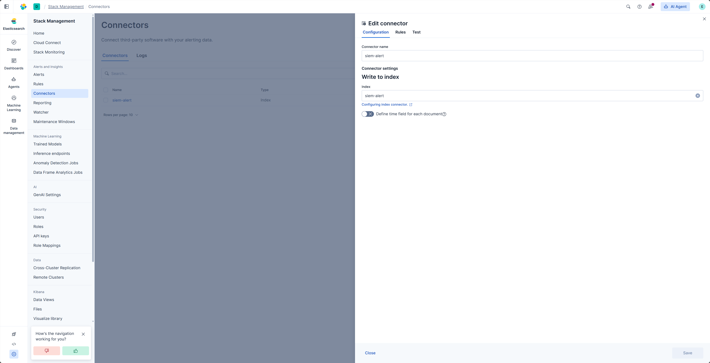
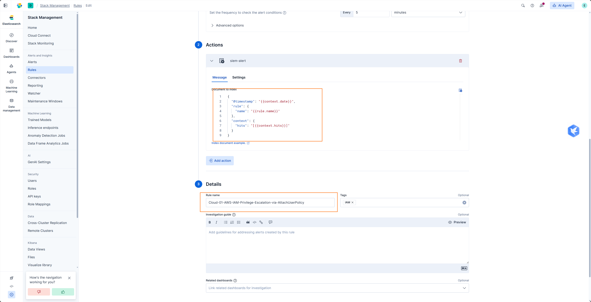
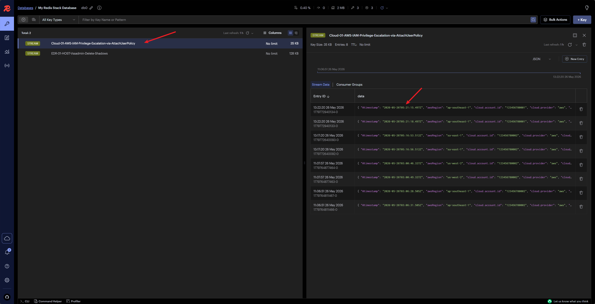

# ELK Index Action

ELK Index Action polls alerts from an Elasticsearch index written by Kibana actions. It is useful when Kibana cannot directly POST to ASP Webhook, or when you prefer writing alert actions to Elasticsearch first and letting ASP pull them.

## How it works

```text
Kibana Rule
  -> Index Action writes to Elasticsearch index
  -> ASP ELK action worker polls Action Index
  -> Converts to Kibana webhook payload
  -> Writes to Redis Stream
  -> Module processes alert and generates Case / Alert / Artifact
```

## Configuration location

ELK connection, Action Index, polling interval, and read size are configured in [SIEM Settings](../../../settings/siem/#elk-index-action).

This page only explains the ingestion flow, Kibana action content, and worker execution.

## Create Index Connector

Create an Index Connector in Kibana to write actions to a specific Elasticsearch index.


The index name is configurable, but it must match the Action Index in SIEM settings.



## Kibana Action content

Create a Kibana Alert Rule and configure query conditions, execution schedule, and trigger conditions.


Add an Index Action to the Rule and use the connector created earlier.




The action document must contain the rule name and the matched original event. ASP reads:

| Field | Description |
| --- | --- |
| `rule.name` | Used as Stream name and alert rule name. |
| `context.hits` | Matched events. It can be an array or a JSON string. |

Example structure:

```json
{
  "@timestamp": "{{context.date}}",
  "rule": {
    "name": "{{rule.name}}"
  },
  "context": {
    "hits": "[{{context.hits}}]"
  }
}
```

After the Rule triggers, new alert documents appear in the Action Index.


## Start Worker

ELK Index Action requires a background worker to run continuously:

```bash
python manage.py run_elk_action_worker
```

Common parameters:

| Parameter | Description |
| --- | --- |
| `--index` | Override Action Index from system settings. |
| `--interval` | Override polling interval from system settings. |
| `--size` | Override read count per batch from system settings. |
| `--start-time` | Start time for first polling, for example `2026-06-23T00:00:00Z`. |


View messages written by the worker in Redis or [Custom Console](../../custom-console/) to confirm that a Module can consume them.



## Difference from Webhook

| Method | Description |
| --- | --- |
| Webhook | SIEM directly POSTs to ASP `/api/webhook/kibana/` or `/api/webhook/splunk/`. |
| ELK Index Action | Kibana first writes actions to Elasticsearch index, then ASP worker polls and reads them. |

Both methods write to Redis Stream and then hand off processing to Modules.

## Recommendations

- If the network allows SIEM to directly access ASP, prefer Webhook.
- If it is more convenient for Kibana to write to Elasticsearch index, use ELK Index Action.
- Ensure `rule.name` and `context.hits` are complete in the action document.
- Keep the worker running continuously; otherwise actions in the index will not be pulled and processed.
- For complete examples, see [Custom Module Examples](../../custom-examples/modules/).
