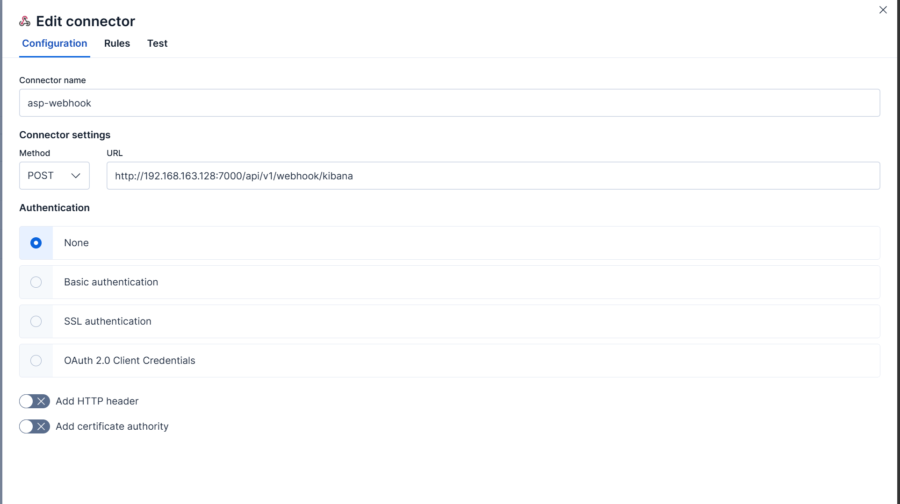
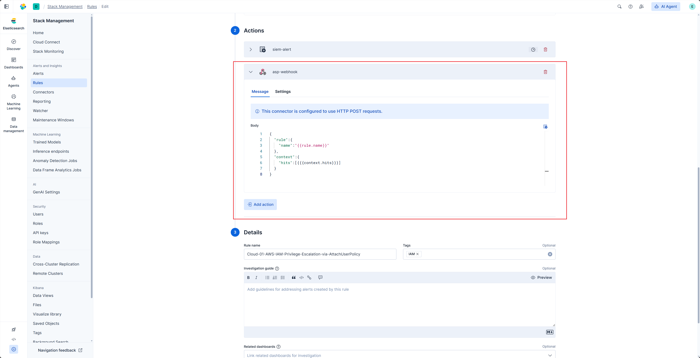

# Kibana Webhook

Kibana Webhook sends Kibana Rule matches directly to ASP and writes them into Redis Stream for Module consumption.

## Endpoint

```text
POST /api/webhook/kibana/
```

Replace the domain with your ASP backend address, for example:

```text
https://asp.example.com/api/webhook/kibana/
```

## Create Webhook Connector

Create a Webhook connector in Kibana and set the URL to the ASP endpoint:

```text
https://<asp-host>/api/webhook/kibana/
```




## Create Rule

Create a Kibana Alert Rule and configure query conditions, execution schedule, and trigger conditions.


## Configure Action

Add a Webhook Action to the Rule and use the connector created earlier.




ASP's Kibana Webhook expects this JSON structure:

```json
{
  "rule": {
    "name": "{{rule.name}}"
  },
  "context": {
    "hits": [{{{context.hits}}}]
  }
}
```

Field description:

| Field | Description |
| --- | --- |
| `rule.name` | Kibana Rule name. It is used as the Redis Stream name. |
| `context.hits` | Matched events. ASP writes each item to Stream. |

## Verification

After the Rule triggers, Kibana sends a request to ASP Webhook. ASP extracts `_source` from each hit and writes it to the Redis Stream named by `rule.name`.


View written messages in Redis or [Custom Console](../../custom-console/) to confirm that a Module can consume them.


## Recommendations

- Webhook requires Kibana to directly access the ASP backend.
- If the network does not allow direct POST to ASP, or ELK uses Community Edition, use [ELK Index Action](../elk-index-action/).
- Keep Rule name consistent with the Stream name expected by the backend Module.
- Preserve key fields in `_source` for Case, Alert, and Artifact mapping.
- For complete examples, see [Custom Module Examples](../../custom-examples/modules/).
