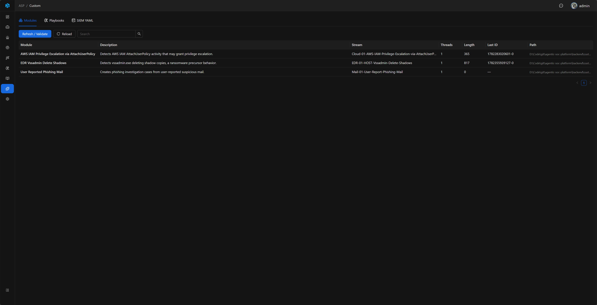
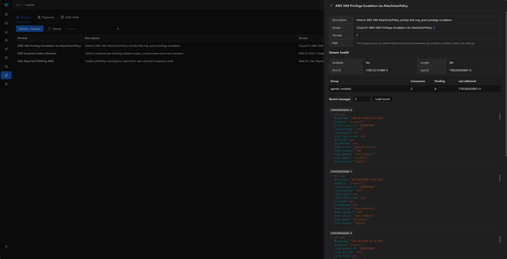

# Custom Console

Custom Console is ASP's runtime inspection and validation page for custom development. It helps confirm whether Modules, Playbooks, and SIEM YAML files are loaded correctly in the current environment. It does not replace an editor and does not create complex definitions online; creation and updates should still be done through the code repository, Claude Code, or related Skills.

## Entry

Custom Console is located in the left navigation as `Custom` and is available only to administrators.

## What It Solves

Custom development spans files, dependencies, Redis Streams, backend registries, and frontend runtime entry points. Custom Console centralizes runtime status so developers can answer:

- Whether a new or modified Module has been discovered.
- Whether the Redis Stream listened to by a Module exists, has messages, and has healthy consumer groups.
- Whether a new or modified Playbook Definition has been discovered, and whether its source, tags, and description are correct.
- Whether SIEM YAML can be parsed, and whether fields, key fields, and backend type match expectations.
- Whether manual refresh/validation has errors, and which file caused the error.

## Page Structure

| Tab | Purpose | Recommended Reading |
| --- | --- | --- |
| Modules | Displays Module name, description, script path, Stream name, thread count, and Stream status. | [Module Development](../module-examples/) |
| Playbooks | Displays runnable Playbook Definitions, source, tags, description, and script path. | [Playbook Development](../playbook/) |
| SIEM YAML | Displays SIEM index YAML, backend type, field count, key field count, and field details. | [SIEM YAML](../siem-yaml/) |

Playbooks distinguish between `official` and `custom` sources. Modules and SIEM YAML do not have an official/custom concept, so no source field is displayed for them.

## Refresh / Validate

Each tab has an independent `Refresh / Validate` action:

- Modules: rescans Module scripts and refreshes the Module list and loading errors.
- Playbooks: rescans built-in and custom Playbook scripts and refreshes Definition list and loading errors.
- SIEM YAML: rescans YAML files and refreshes the SIEM registry cache.

Opening the page automatically reads current loaded status and does not write Audit Log. Manually executing `Refresh / Validate` writes Audit Log, making it clear who triggered a rescan and when.

If only script definitions or YAML content changed, `Refresh / Validate` is usually enough. If `custom\requirements.txt`, third-party Python packages, or shared helper modules changed, reinstall dependencies and restart related containers before validating again in Custom Console.

## Modules

The Modules tab is used to inspect whether Modules have been recognized by runtime and how they relate to Redis Streams.

Main list fields:

| Field | Description |
| --- | --- |
| Module | The Module `NAME`. |
| Description | The Module `DESC`. |
| Stream | The Module `STREAM_NAME`; it must match the Stream name written by Webhook / ELK Index Action. |
| Threads | The Module `THREAD_NUM`. |
| Stream Health | Whether Redis Stream exists, length, first/last message IDs, and consumer group summary. |
| Path | Module script path. |

### Stream Inspection

Module details can inspect Redis Stream in read-only mode:

- Stream basic information.
- Consumer group summary.
- Recent message JSON.
- Read a specific message by message ID.

This feature is read-only. It does not write to the Stream, consume messages, delete the Stream, or trigger Module execution. It is useful for confirming whether SIEM alerts have entered the Stream and whether Stream status looks reasonable before and after Module consumption.

## Playbooks

The Playbooks tab displays Playbook Definitions that can be run from a Case page. It only displays and validates definitions; it does not run Playbooks from Custom Console. To test a Playbook, use `Run Playbook` on a Case detail page.

Main list fields:

| Field | Description |
| --- | --- |
| Playbook | The Playbook `NAME`. |
| Source | `official` or `custom`. |
| Tags | The Playbook `TAGS`, used for filtering and identifying purpose. |
| Description | The Playbook `DESC`. |
| Path | Playbook script path. |

Prompt files are not managed by Custom Console. A Playbook may keep prompts in code or call `self.read_prompt("System")` to read prompt files; Custom Console does not validate whether prompt files exist.

## SIEM YAML

The SIEM YAML tab displays each YAML-defined index, backend, field count, key field count, and field table. It helps confirm whether the SIEM schema visible to Agent / MCP matches expectations.

The field table includes:

| Field | Description |
| --- | --- |
| Name | Field name. |
| Type | Field type. |
| Key field | Whether it is marked as a key field. |
| Description | Field meaning. |
| Sample values | Example values. |

Creating or substantially updating YAML usually requires understanding log structure and query scenarios. Use the [SIEM YAML](../siem-yaml/) documentation or the [SIEM Index YAML Skill](../../integrations/claude-code/skills/siem-index-yaml/) to help create it. Custom Console only displays and validates the final loaded result.

## Related Documentation

- [Custom Development Overview](../): Learn how Module, Playbook, and SIEM YAML relate to each other in ASP.
- [Module Development](../module-examples/): Write Redis Stream consumption logic.
- [Playbook Development](../playbook/): Write Case-triggered automation tasks.
- [SIEM YAML](../siem-yaml/): Maintain index field definitions queryable by Agent / MCP.
- [Deployment: Custom Directory](../../quick-start/deployment/#custom-directory): Learn the `custom/` directory structure and dependency installation workflow in deployment packages.
