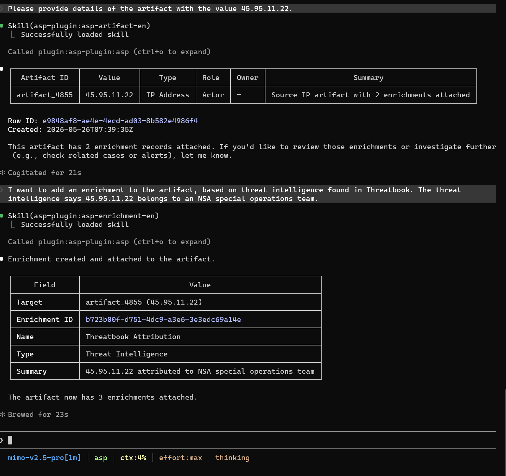

# Enrichment

Enrichment Skill is used to save structured investigation results as Enrichment and attach to Case, Alert, or Artifact.

## Trigger Scenarios

- Need to persist SIEM query results, threat intelligence, asset context, or investigation conclusions.
-希望把结构化分析结果附加到某个对象。

## Usage Example

## Input

| Input | Description |
|-------|-------------|
| `target_id` | Attachment target, e.g., `case_000001`、`alert_000001`、`artifact_000001`。 |
| `name` | Enrichment name. |
| `type` | Type, e.g., Threat Intelligence, CMDB, Identity. |
| `value` | Enrichment value. |
| `desc` | Summary. |
| `data` | Detailed JSON data. |

## Output

Created Enrichment record ID and attachment confirmation.

## Dependencies

MCP tool: `create_enrichment`.
