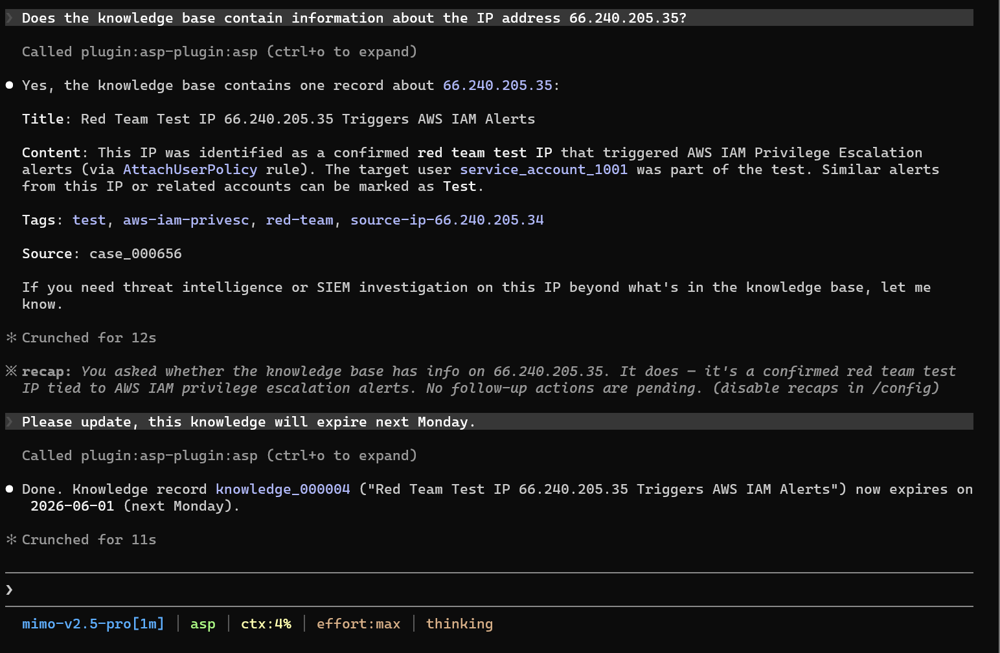

# Knowledge

Knowledge Skill is used to search and maintain ASP knowledge base.

## Trigger Scenarios

- Search historical experience, handling suggestions, or false positive judgments by keyword.
- Update knowledge entry title, body, tags, or expiration time.
- Find reusable experience during Case investigation.

## Usage Example

## Input

| Input | Description |
|-------|-------------|
| `keyword` | Search keyword, matches title, body, or tags. |
| `knowledge_id` | Readable knowledge ID. |
| Update fields | `title`、`body`、`expires_at`、`tags`。 |

## Output

Knowledge entry list or updated knowledge record.

## Dependencies

MCP tools: `search_knowledge`、`update_knowledge`.
