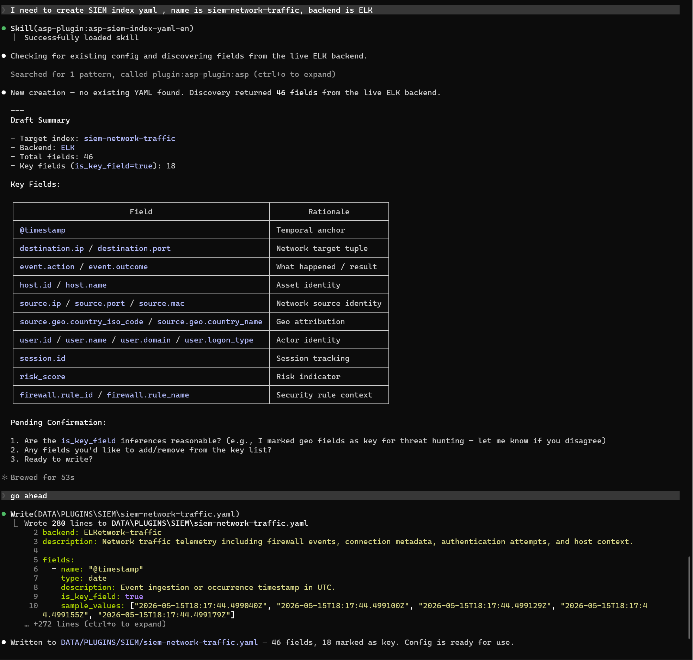

# SIEM Index YAML

SIEM Index YAML Skill is used to create or update SIEM index configuration YAML.

## Trigger Scenarios

- Generate `custom/data/siem/*.yaml` for indexes in Splunk or ELK.
- Discover fields from backend in real-time and supplement field descriptions, types, and key field markers.
- Enable Agent / MCP to understand and query SIEM data sources through schema.

## Usage Example

## Input

| Input | Description |
|-------|-------------|
| `index_name` | SIEM index name. |
| `backend` | `Splunk` or `ELK`. |
| Time range | Used to discover field samples. |

## Output

YAML draft or written index configuration file.

## Dependencies

MCP tools: `siem_discover_index_fields`、`siem_explore_schema`.
