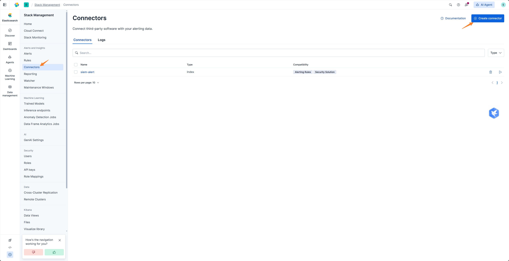

# ELK Index Action

ELK Index Action is used to poll alerts from Elasticsearch indexes written by Kibana actions. It is suitable for scenarios where Kibana cannot directly POST to ASP Webhook, or when you prefer to first write alert actions to Elasticsearch and then have ASP pull them.

## How It Works

```text
Kibana Rule
  → Index Action writes to Elasticsearch index
  → ASP ELK action worker polls Action Index
  → Converts to Kibana webhook payload
  → Writes to Redis Stream
  → Module processes alert and generates Case / Alert / Artifact
```

## Configuration Location

ELK connection, Action Index, polling interval, and read count are configured in [SIEM Settings](../../settings/siem/#elk-index-action).

This page only explains the ingestion flow, Kibana action content, and worker execution.

## Create Index Connector

Create an Index Connector in Kibana to write actions to a specified Elasticsearch index.




The index name can be customized, but must be consistent with the Action Index in SIEM settings.


## Kibana Action Content

Create a Kibana Alert Rule, configure query conditions, execution period, and trigger conditions.


Add an Index Action to the Rule and use the connector created earlier.


The document written by the action needs to contain the rule name and the original event that命中. ASP will read:

| Field | Description |
|-------|-------------|
| `rule.name` | Used as Stream name and alert rule name. |
| `context.hits` | List of events命中 by the alert, can be an array or JSON string. |

Example structure:

```json
{
  "@timestamp": "{{context.date}}",
  "rule": {
    "name": "{{rule.name}}"
  },
  "context": {
    "hits": "[{{context.hits}}]"
  }
}
```

After the Rule triggers, new alert documents will appear in the Action Index.


## Start Worker

ELK Index Action requires a background worker to run continuously:

```bash
python manage.py run_elk_action_worker
```

Common parameters:

| Parameter | Description |
|-----------|-------------|
| `--index` | Override Action Index in system settings. |
| `--interval` | Override polling interval in system settings. |
| `--size` | Override read count per batch in system settings. |
| `--start-time` | Start time for first polling, e.g., `2026-06-23T00:00:00Z`. |


You can view messages written by the worker in Redis to confirm that subsequent Module can consume them.


## Difference from Webhook

| Method | Description |
|--------|-------------|
| Webhook | SIEM directly POSTs to ASP's `/api/webhook/kibana/` or `/api/webhook/splunk/`. |
| ELK Index Action | Kibana first writes actions to Elasticsearch index, then ASP's worker polls and reads them. |

Both methods进入 ASP 后都会复用当前告警处理流程。

## Usage Recommendations

- If the network allows SIEM to directly access ASP,优先使用 Webhook。
- If it's only convenient for Kibana to write to Elasticsearch index,可以使用 ELK Index Action。
- Ensure the `rule.name` and `context.hits` fields in the action document are complete.
- Keep the worker running continuously, otherwise actions in the index will not be pulled and processed.
