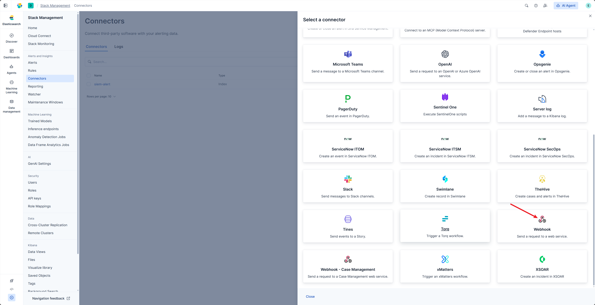
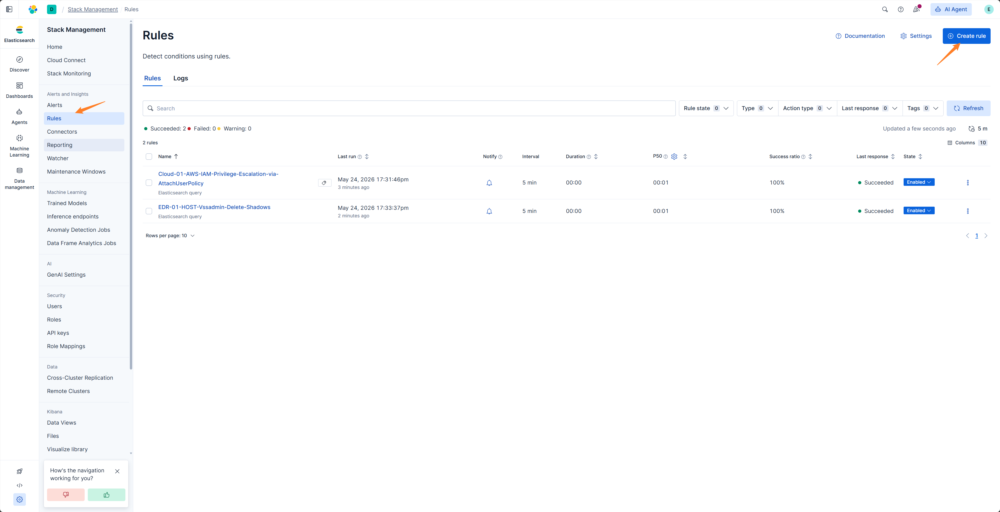

# ELK / Kibana Webhook

ELK / Kibana Webhook is used to send Kibana Rule命中 results directly to ASP.

## Endpoint

```text
POST /api/webhook/kibana/
```

Replace the domain in the address with your ASP backend address, for example:

```text
https://asp.example.com/api/webhook/kibana/
```

## Create Webhook Connector

Create a Webhook connector in Kibana,填写 ASP current endpoint:

```text
https://<asp-host>/api/webhook/kibana/
```




## Create Rule

Create a Kibana Alert Rule, configure query conditions, execution period, and trigger conditions.




## Configure Action

Add a Webhook Action to the Rule and use the connector created earlier.


ASP's current Kibana Webhook requires the following JSON structure:

```json
{
  "rule": {
    "name": "{{rule.name}}"
  },
  "context": {
    "hits": [{{{context.hits}}}]
  }
}
```

Field description:

| Field | Description |
|-------|-------------|
| `rule.name` | Kibana Rule name, will be used as Redis Stream name. |
| `context.hits` | List of命中 events, ASP will write each one to Stream. |

## Verification

After the Rule triggers, Kibana will send requests to ASP Webhook. ASP will extract the `_source` of each hit and write it to a Redis Stream named after `rule.name`.


You can view written messages in Redis to confirm that subsequent Module can consume them.


## Usage Recommendations

- Webhook method requires Kibana to directly access ASP backend.
- If the network does not allow direct POST to ASP or ELK uses **Community Edition**, you can use [ELK Index Action](../../elk-index-action/) instead.
- Keep Rule name consistent with the Stream name that the backend Module expects to consume.
- Preserve key fields in `_source` for Case, Alert, Artifact mapping.
