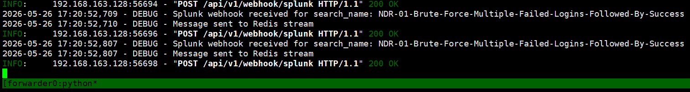

# Splunk Webhook

Splunk Webhook is used to send Splunk Alert results directly to ASP.

## Endpoint

```text
POST /api/webhook/splunk/
```

Replace the domain in the address with your ASP backend address, for example:

```text
https://asp.example.com/api/webhook/splunk/
```

## Create Alert in Splunk

Write SPL and save as Alert.


Recommended configuration:

- Cron Expression / Time Range set based on detection frequency, for example execute every 5 minutes, search前 5 minutes data.
- Trigger select `For each result`,确保每个结果独立发送一次 Webhook。
- Webhook URL fill in ASP current endpoint: `https://<asp-host>/api/webhook/splunk/`.

## Payload Requirements

ASP's current Splunk Webhook reads the following fields:

| Field | Description |
|-------|-------------|
| `search_name` | Splunk Alert name, will be used as Redis Stream name. |
| `result` | Single alert result, will be written to Stream for Module processing. |
| `sid` | Optional, Splunk search job id. |
| `app` | Optional, Splunk app. |
| `owner` | Optional, Splunk owner. |
| `results_link` | Optional, link back to Splunk to view results. |

## Verification

After Alert triggers, Splunk will send requests to ASP Webhook. After ASP returns success, the result will be written to a Redis Stream named after `search_name`.



You can view written messages in Redis to confirm that subsequent Module can consume them.


## Usage Recommendations

- Keep SPL output fields stable,避免 Module 字段映射频繁变化。
- Alert name should be consistent with the Stream name that the backend Module expects to consume.
- Output stable correlation fields for the same type of events,便于后续生成 Correlation UID。
