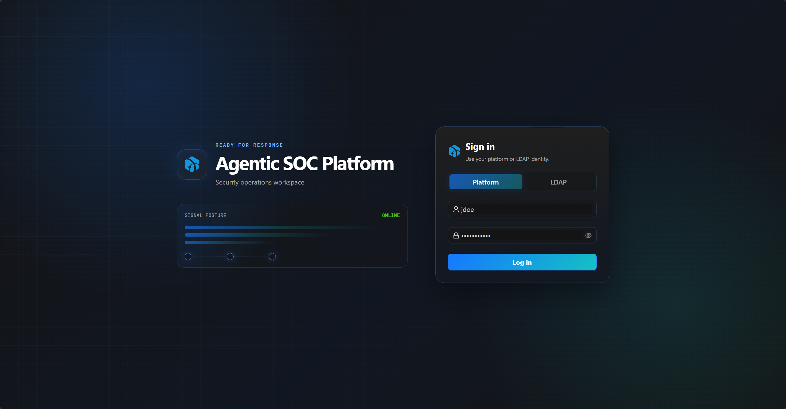

# First Login

ASP supports local account and LDAP account login. The login page provides Platform / LDAP switching.

## Login Page

After opening the ASP access URL, you will enter the login page. Select `Platform` to log in with a local account, select `LDAP` to log in with enterprise LDAP credentials.



## Local Account

Local accounts are managed by the Django user system. After initial deployment, the admin account needs to be created via the backend command line:

```powershell
cd backend
.\.venv\Scripts\python.exe manage.py createsuperuser
```

The created admin is a Django superuser, use `Platform` on the login page to log in.

After successful login, the frontend will save the access token and obtain current user information via `/api/auth/me/`.

For more details on admin account maintenance, see [User Management](../../settings/users/#admin-account).

## User Management

After logging in with the admin account, go to the [User Management](../../settings/users/) page in system settings to create regular users or read-only users.

| Role | Description |
|------|-------------|
| admin | Django superuser, can access system settings. |
| user | Can create, update, and delete business resources. |
| viewer | Read-only user. |

Web UI can only create and assign `user` / `viewer`, cannot create admin.

## LDAP Account

LDAP login requires first enabling and configuring [LDAP](../../settings/ldap/) in system settings, and using the test function to confirm connection and account query are available.

LDAP does not automatically create ASP users. The admin needs to first create an ASP user with Authentication Type set to LDAP, then the user can select `LDAP` on the login page and log in with LDAP password.

Local users cannot log in via LDAP, and LDAP users cannot log in via Platform password.

## Login Failure Troubleshooting

| Symptom | Check |
|---------|-------|
| Invalid credentials | Confirm username, password, and Platform / LDAP selection match. |
| LDAP user cannot log in | Confirm the same-name LDAP user exists in ASP, LDAP settings are enabled and tested. |
| Local user cannot log in | Confirm Platform is selected and the account is not disabled. |
| Admin cannot access system settings | Confirm the account is a Django superuser. |

## Post-Login Recommendations

After first login, it is recommended to complete in order:

- Go to [Basic Configuration](../basic-configuration/) to configure LLM, SIEM, Threat Intelligence, and Runtime.
- Create team member accounts in [User Management](../../settings/users/).
- Maintain your profile in [Personal Center](../../workspace/personal-center/), and create API Key if necessary.
