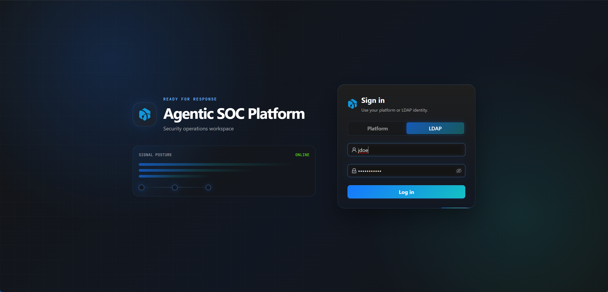

# LDAP

LDAP is used to connect to enterprise identity sources.

## Entry

LDAP settings are located in the `LDAP` Tab of System Settings.

## Configuration Items

| Field | Description |
|-------|-------------|
| Enabled | Whether to enable LDAP login. |
| Server URI | LDAP server address, must start with `ldap://` or `ldaps://`. |
| Domain | Used in direct bind mode to拼接 `username@domain`。 |
| Bind DN | Optional service account DN for searching users first. |
| Bind Password | Password for Bind DN. |
| User Search Base DN | Starting DN for user search. |
| User Login Attr | Login name matching field, default `uid`. |

## Common Windows AD Configuration

Windows Active Directory typically uses search bind mode:

| Field | Example |
|-------|---------|
| Server URI | `ldaps://ad.example.com:636` or `ldap://ad.example.com:389` |
| Domain | `example.com` |
| Bind DN | `svc_asp@example.com` or `CN=svc-asp,OU=Service Accounts,DC=example,DC=com` |
| Bind Password | Service account password |
| User Search Base DN | `DC=example,DC=com` or `OU=Users,DC=example,DC=com` |
| User Login Attr | `sAMAccountName` |

If you希望用户用 UPN 登录，也可以把 `User Login Attr` 设置为 `userPrincipalName`，并要求用户在登录页输入完整 UPN，例如 `alice@example.com`。

## Authentication Mode

When `User Search Base DN` is configured, the backend will first use Bind DN / Bind Password for service bind, then search for user DN by `User Login Attr=<username>`, and finally use the user's input password to bind that user DN.

When `User Search Base DN` is not configured, the backend will directly bind the user: if Domain is configured, use `username@domain`; otherwise use `username` directly.

## Test Connection

When Test Username / Test Password are not filled in, Test only verifies whether LDAP bind succeeds. When test account is filled in, username and password must be provided together, and the backend will execute a complete user authentication according to current configuration.

## Login Flow

1. Admin enables and saves LDAP configuration.
2. Use test function to confirm connection and account query are available.
3. Admin creates ASP user with Authentication Type set to LDAP in user management.
4. User switches to LDAP on login page.
5. Backend confirms ASP user exists, account is enabled, authentication type is LDAP.
6. Backend uses LDAP to verify user credentials and logs in as that ASP user.

LDAP login does not automatically create ASP users, nor does it automatically assign roles. Local users cannot log in using LDAP method, and LDAP users cannot log in using local password method.

## Security and Audit

Bind Password is hidden by default. Saving configuration, testing connection, and revealing Bind Password are all written to Audit Log; password fields in audit records only记录是否 changed 或 reveal，不写入明文。

After saving configuration, the backend will刷新 LDAP runtime cache，后续登录使用最新配置。

## Usage Recommendations

- Production environment优先使用 `ldaps://`。
- Windows AD typically uses `sAMAccountName` as User Login Attr.
- Control User Search Base DN to the actual user's OU or domain scope.
- First use Test Username / Test Password to verify real user login before opening to users.
