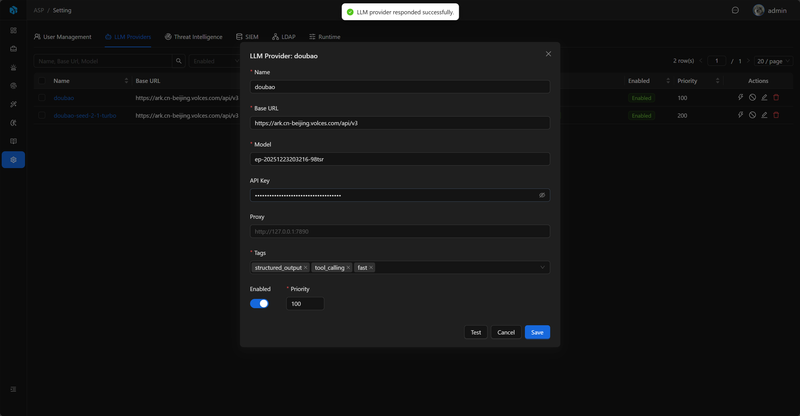

# LLM Provider

LLM Provider defines the large model connection method used by ASP. AI investigation, knowledge extraction, and Runtime select models from enabled Providers by tags and priority.

## View

LLM Providers list displays Name, Base URL, Model, Tags, Enabled, and Priority.

The list supports quick filtering by Enabled and Tags, and also supports advanced filtering by Name, Base URL, Model, Enabled, and Priority to locate configurations.

## Fields

| Field | Description |
|-------|-------------|
| Name | Configuration name, unique. |
| Base URL | OpenAI Chat Completions compatible model service address. |
| Model | Model name. |
| API Key | Access key, can be filled according to model service requirements. |
| Proxy | Optional proxy. |
| Tags | Model capability tags. |
| Enabled | Whether enabled. |
| Priority | Priority, smaller number means higher priority. |

## Add and Edit

Admins can add, edit, enable, disable, or delete LLM Providers. When editing, saved configuration is read; API Key is hidden by default, only loaded through reveal when editing.

Proxy supports addresses starting with `http://`、`https://`、`socks4://`、`socks5://`。

## Tag Selection

Common tags:

- `fast`
- `powerful`
- `tool_calling`
- `structured_output`

At least one tag must be filled. The frontend provides common tags, but you can also add custom tags based on actual scenarios.

Different tasks select appropriate models based on tags. For example, structured output related tasks will优先选择带有 `structured_output` 的 Provider。

## Test Connection

When adding or editing configuration, you can directly Test; saved Providers can also be Test from the list.

The test will call the Provider's Chat Completions compatible interface and send a simple request to confirm model service is available.

## Runtime Selection

Only Enabled Providers enter runtime configuration. Runtime sorts by Priority, Name, Created Time:

- When no tag is specified, use the first Provider after sorting.
- When one tag is specified, select the first Provider containing that tag.
- When multiple tags are specified, select the first Provider containing all tags.

If there are no enabled Providers, or no Providers matching specified tags, related AI tasks will fail.

## Security and Audit

Creating, updating, deleting, testing, and revealing API Key are all written to Audit Log. API Key fields in audit records only记录是否发生变化或 reveal，不写入明文。

## Usage Recommendations

- At least configure one enabled `structured_output` Provider for investigation reports and knowledge extraction.
- Use Priority to control default model selection order, smaller number means higher priority.
- Use Tags to distinguish fast models, strong reasoning models, tool calling models, and structured output models.
- After saving, first execute Test to confirm Base URL, Model, API Key, and Proxy configuration are correct.
