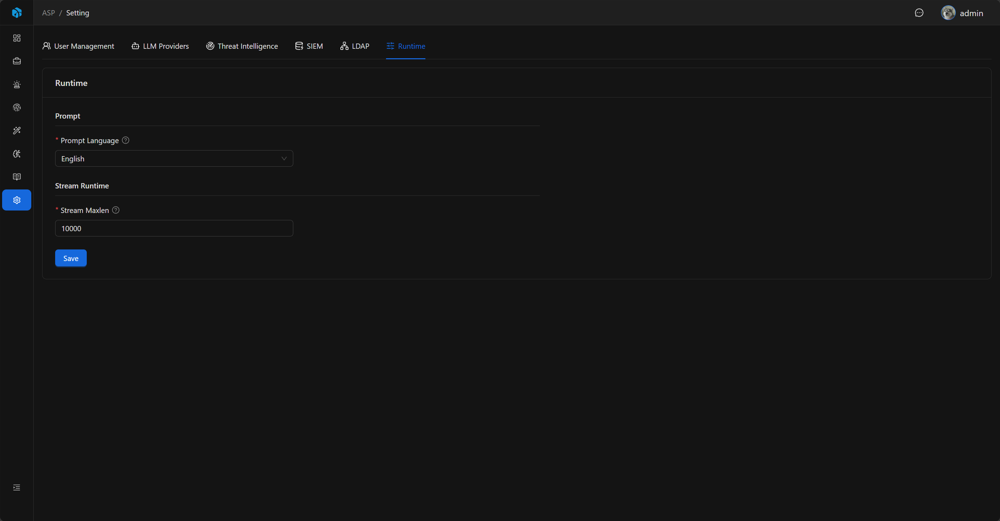

# Runtime

Runtime stores ASP's Agentic runtime configuration, currently including prompt language and Webhook Stream retention length.

## Entry

Runtime settings are located in the `Runtime` Tab of System Settings.

## Fields

| Field | Default | Description |
|-------|---------|-------------|
| Prompt Language | `en` | Prompt language used for Agentic analysis and knowledge extraction. |
| Stream Maxlen | `10000` | Approximate maximum length retained when writing Webhook alerts to Redis Stream. |

## Prompt Language

Prompt Language supports `en` and `zh`.

The backend reads corresponding language prompt files based on this value, for example:

- `backend\data\prompt\analysis\System_en.md`
- `backend\data\prompt\analysis\System_zh.md`
- `backend\data\prompt\analysis\KnowledgeKeywords_en.md`
- `backend\data\prompt\knowledge_extraction\System_en.md`

This configuration affects Case AI investigation, knowledge keyword extraction, and Knowledge Extraction.

## Stream Maxlen

Stream Maxlen is used to control the retention length when Splunk / Kibana Webhook alerts are written to Redis Stream.

It is an approximate maximum length used to prevent alert Streams from growing without bound. The default value is `10000`.

## Save and Audit

After saving Runtime configuration, the backend refreshes the Runtime cache, and subsequent Runtime reads use the new value.

Runtime configuration updates are written to Audit Log.

## Usage Recommendations

- Chinese teams can set Prompt Language to `zh` so investigation and knowledge extraction use Chinese prompts.
- Stream Maxlen should be adjusted based on alert volume; larger alert volume may require a larger retention length.
- After modifying Runtime, observe the effect from new Cases or new Webhook alerts.
