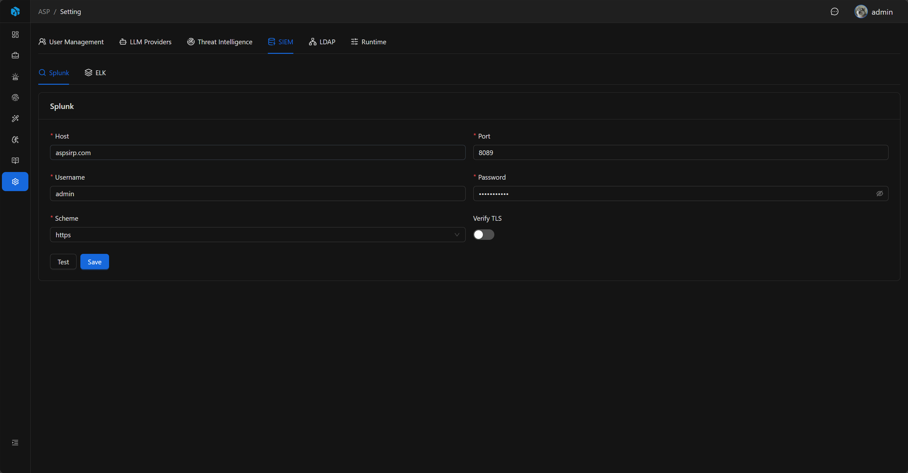

# SIEM

ASP currently provides Splunk and ELK connection configurations for log queries, Agent investigation, and alert ingestion.

## Entry

SIEM settings are located in the `SIEM` Tab of System Settings,包含 Splunk 和 ELK 两个子 Tab。

## Splunk

Splunk configuration is used to connect to Splunk management interface for SIEM query capabilities.

| Field | Description |
|-------|-------------|
| Host | Splunk server address. |
| Port | Splunk management port, default `8089`. |
| Username | Login username. |
| Password | Login password. |
| Scheme | `http` or `https`. |
| Verify | Whether to verify certificate. |

After configuration, you can use the test function to verify connection.

## ELK

ELK configuration is used to connect to Elasticsearch for SIEM query capabilities and ELK Index Action.

| Field | Description |
|-------|-------------|
| Host | Elasticsearch server address. |
| API Key | Elasticsearch API Key. |
| Verify Certs | Whether to verify certificate. |
| Request Timeout Seconds | Request timeout time. |
| Process Alert From Index Enabled | Whether to enable ELK Index Action polling. |
| Action Index | Index name where Kibana actions are written. |
| Action Poll Interval Seconds | Polling interval. |
| Action Size | Maximum number of actions read per batch. |

## Connection Test and Audit

Both Splunk and ELK support Test. Splunk test connects to Splunk and reads service info; ELK test connects to Elasticsearch and reads cluster info.

Saving configuration, testing connection, and revealing keys are all written to Audit Log. Splunk Password and ELK API Key are hidden by default, audit records only记录是否 changed 或 reveal，不写入明文。

After saving SIEM configuration, the backend刷新 SIEM 客户端缓存，后续查询使用最新连接信息。

## SIEM Query and Index Configuration

SIEM connection configuration is only responsible for providing Splunk / ELK backend credentials. Agent and MCP SIEM queries also depend on index configuration in `custom\data\siem\*.yaml`.

YAML index configuration is used to describe searchable indexes, backend types, field meanings, and default aggregation fields. Unconfigured indexes will not appear in schema list and will not participate in schema-based queries.

## ELK Index Action

After enabling `Process Alert From Index Enabled`, the background worker will read Kibana action documents from Elasticsearch according to configured Action Index, Poll Interval, and Action Size.

Read actions will be converted to Kibana webhook alert processing flow,继续进入 ASP 的告警接入和 Case / Alert / Artifact 生成流程。

For complete ingestion flow, Kibana action content, and worker execution, see [ELK Index Action](../../integrations/elk-index-action/).

## Usage Recommendations

- After saving, first execute Test to confirm network, account, certificate, and key configuration are correct.
- Only enable ELK Index Action when需要从 Kibana action index 拉取告警时。
- Maintain `custom\data\siem\*.yaml` index configuration for Agent / MCP queries,避免让 LLM 在未知索引中盲查。
- Webhook ingestion请参考集成章节，不在 SIEM 设置页配置。
