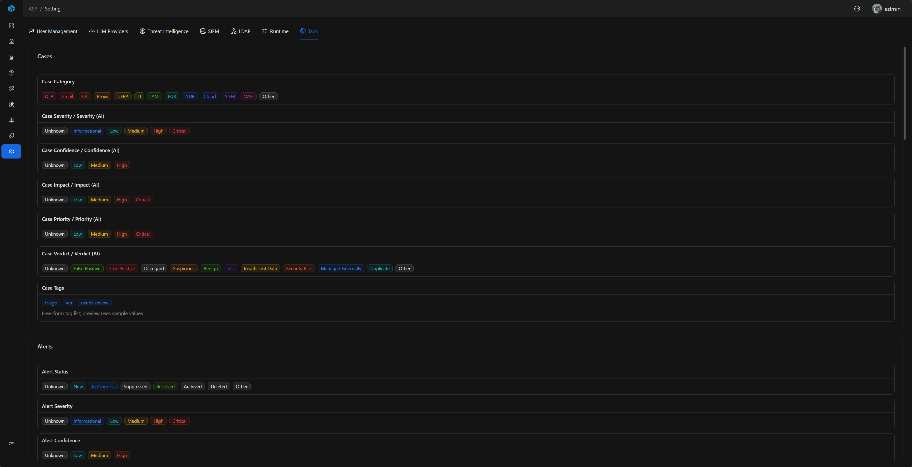

# Tags

Tags is a read-only preview page in System Settings. It centralizes the frontend Tag fields, enum values, and color effects currently used by ASP.

## Entry

Tags is located in the `Tags` tab of System Settings and is available only to administrators.

## Page Content

The Tags page groups common frontend Tags by business area:

- Cases: Category, Severity, Confidence, Impact, Priority, Verdict, etc.
- Alerts: Severity, Risk Level, Disposition, Action, Product Category, Analytic Type, etc.
- Artifacts / Enrichments: Artifact Type, Artifact Role, Enrichment Type, Provider, etc.
- Knowledge / Playbooks / Users / Settings: Knowledge Source, Playbook Tags, User Role, LLM Provider Tags, etc.
- Custom Console / System UI: SIEM Backend, Audit Action, Inbox Kind, etc.

This page does not modify data or save configuration. Its purpose is to let administrators and developers inspect field enums and colors without creating test records.

## Risk Level Color Scale

Severity, Confidence, Impact, Priority, and Risk Level currently share the same risk color scale:

| Level | Color |
| --- | --- |
| Critical | red |
| High | volcano |
| Medium | gold |
| Low | cyan |
| Info / Informational | blue |
| Unknown / Other | default |
