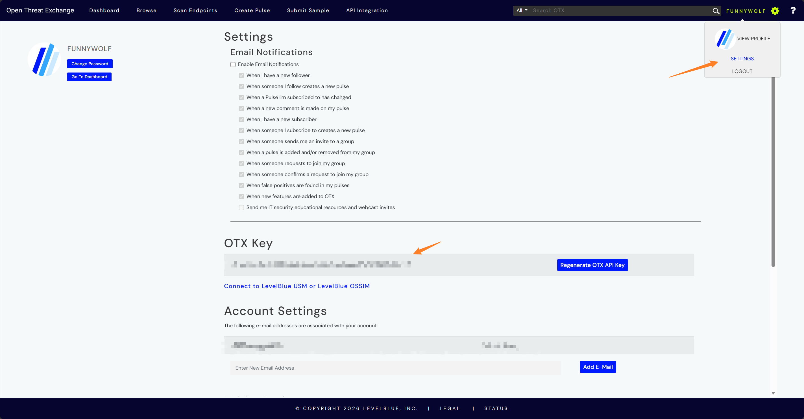

# Threat Intelligence

Threat Intelligence settings are used to configure ASP's IOC query capabilities. The current settings page内置 AlienVault OTX。

## Entry

Threat Intelligence settings are located in the `Threat Intelligence` Tab of System Settings.

## AlienVault OTX

After registering AlienVault OTX, you can获取 API Key from the account settings page.

## Configuration Items

| Field | Description |
|-------|-------------|
| Enabled | Whether to enable AlienVault OTX. |
| API Key | AlienVault OTX API Key. |
| Base URL | OTX API address, default `https://otx.alienvault.com/api/v1`. |
| Proxy | Optional proxy. |
| Timeout Seconds | Query timeout time. |

Proxy supports addresses starting with `http://`、`https://`、`socks4://`、`socks5://`。

## Test and Audit

Before saving, you can use Test to verify configuration. The test will use current configuration to access OTX's IPv4 general interface,确认 API Key、Base URL、Proxy 和 Timeout 是否可用。

Saving configuration, testing connection, and revealing API Key are all written to Audit Log. API Key is hidden by default, audit records only记录是否 changed 或 reveal，不写入明文。

After saving configuration, the backend刷新 OTX runtime cache，后续查询使用最新配置。

## Enrichment Flow

`Threat Intelligence Enrichment` Playbook will collect Artifacts from Case-associated Alerts, query threat intelligence for each unique Artifact, and write results to Artifact's Enrichment.

Written Enrichment type is `Threat Intelligence`，包含 Provider、risk level、reputation score、malicious judgment、tags、attack techniques、malware families、pulse summary、and raw data summary 等上下文。

## Provider Behavior

The current settings page only configures AlienVault OTX. At runtime, if OTX is enabled and API Key exists, `AlienVaultOTX` Provider will be used; otherwise it will回退到 `MockTIProvider`，用于演示或测试。

Current OTX queries mainly handle IPv4, URL, MD5/SHA1/SHA256 file hashes. Unsupported Artifact types will be recorded as unsupported and will not write valid enrichment results.

## Usage Recommendations

- First use test function to confirm API Key and network are available.
- Configure Proxy for proxy environments.
- Control Timeout to avoid external services affecting investigation flow.
- Only enable OTX after confirming API Key is available.
- After executing Threat Intelligence Enrichment from Case,回到 Artifact 的 Enrichments 查看结果。
