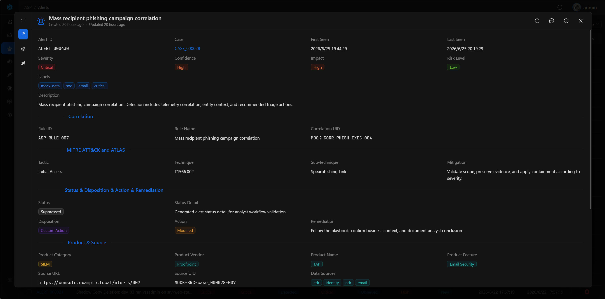
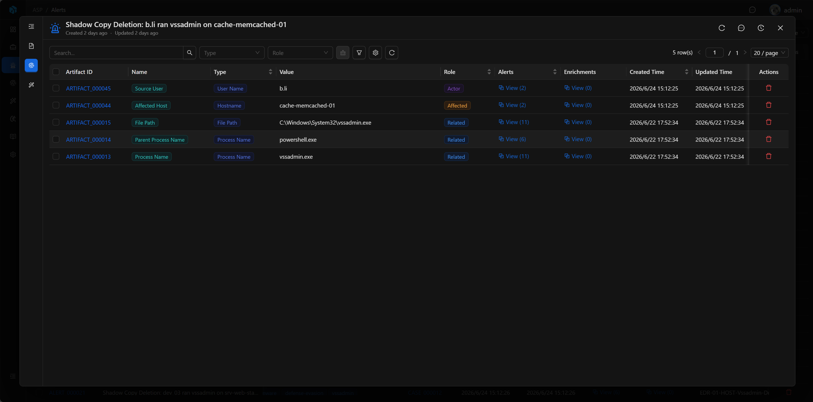

# Alert

Alert is an alert record from SIEM, EDR, cloud platforms, or Webhook. It is the evidence layer and detection context layer of Case, used to preserve alert source, rules, products, MITRE, raw logs, and extracted Artifacts.

Alerts typically do not serve as the final disposition object for independent closure. Analysts investigate and respond based on Alerts, but final judgment, collaborative discussion, closure summary, and disposition decisions should be completed in Case.

## View

The Alert list centrally displays all alert records, supports quick filtering by severity, confidence, impact, etc., and also supports advanced search by rules, products, tags, source ID, time, etc.

## Key Fields

- Alert ID: System-generated readable ID.
- Case: Associated case.
- Title: Alert title.
- Severity, Confidence, Impact, Risk Level: Risk information.
- Disposition, Action, Status: Alert source and disposition status.
- Rule ID, Rule Name, Correlation UID, Source UID: Source and correlation information.
- Product Vendor, Product Name, Product Feature: Source product.
- Tactic, Technique, Sub-technique: MITRE mapping.
- Raw Data, Unmapped: Raw data and unmapped fields.

## Basic

Basic displays the core information of the Alert: title, risk assessment, detection description, source rules, product information, MITRE mapping, and disposition status.

By default, Alert fields are used to present factual information from the source system and detection rules. Analysts typically do not directly modify alert data, but proceed to Case based on alert content to complete judgment and response.

## Artifacts

Artifacts display entities and IOC extracted from or associated with the Alert, such as IP, domain, account, host, file hash, etc. They are the foundation for subsequent threat intelligence queries, asset verification, blocking, and scope determination.

## Enrichments

Enrichments display enrichment results associated with the Alert, such as external context including threat intelligence, reputation, assets, identity, history, etc.

## Raw Log & Unmapped Data

Raw Log is the raw log content of the alert, typically stored in JSON. It is used for tracing alert sources, verifying field mapping, locating original events, and investigating false positives.

Unmapped Data preserves data from the raw alert that is not mapped to standard fields. It retains additional information from the source system, but is not the focus of default AI analysis.

## Usage Recommendations

- Enter associated Alert from Case to view detection context and original evidence.
- Use Rule ID, Rule Name, Source UID, and Correlation UID to trace back to the source system and locate alerts.
- View Artifacts to determine which entities and IOC are involved.
- View Raw Log / Unmapped Data to verify field mapping completeness.
