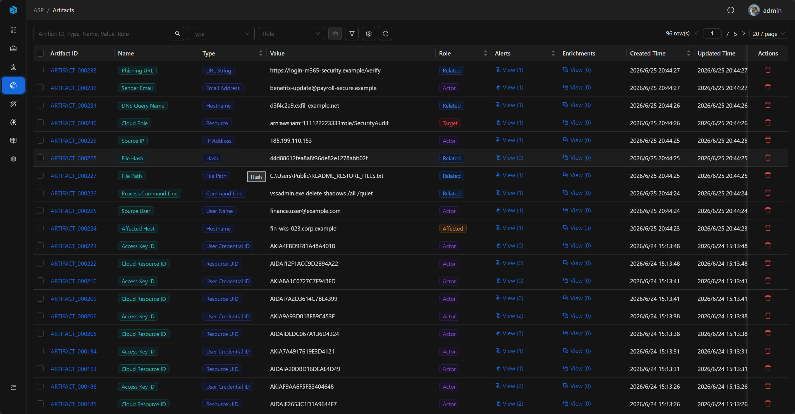
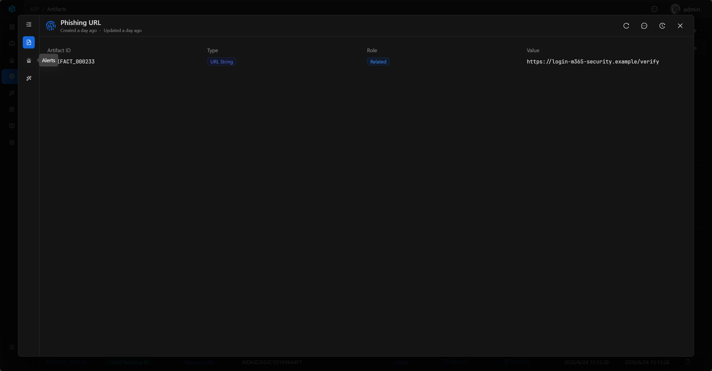

# Artifact

Artifact represents an entity, evidence item, or IOC in a security incident, such as IP, domain, URL, file hash, account, host, process, registry key, cloud resource, etc.

During investigation, many queries, responses, and enrichment actions revolve around Artifact: for example, querying the owner of a host, querying threat intelligence for a file hash, or confirming whether an IP needs to be blocked. Artifact is the key layer that transforms "fields in alerts" into "investigatable objects."

## View

The Artifact list is used to centrally view extracted entities and IOC. The list displays Artifact ID, Name, Type, Value, Role, Alerts, Enrichments, Created Time, and Updated Time. Analysts can quickly see the entity itself, its role in the incident, and the number of associated contexts.

The list supports quick filtering by Type and Role, and also supports advanced filtering by Artifact ID, Type, Role, Name, Value, Created Time, and Updated Time to locate records.

## Key Fields

- Artifact ID: System-generated readable ID.
- Name: Entity name.
- Type: Entity type.
- Role: Role in the incident, such as Target, Actor, Affected, Related.
- Value: Entity value.

## Basic

Name is used for list and detail dialog titles to help quickly identify the current entity. Basic displays Artifact ID, Type, Role, and Value: Type represents the entity type, Role represents its role in the incident, and Value is the actual entity value used for queries, responses, and enrichment.

## Relationships

Artifact can be associated with multiple Alerts and can also have multiple Enrichments.

## Alerts

Alerts display alerts associated with the current Artifact. Analysts can use this to trace back which alerts the same entity appears in, then enter Alert details to view detection rules, raw logs, and the associated Case.

## Enrichments

Enrichments display external context generated around the Artifact, such as threat intelligence, reputation, assets, identity, history, vulnerability information, etc.

These enrichment results can help analysts determine whether an entity is malicious, whether it belongs to internal assets, whether it has appeared in other incidents, and how to respond next. Analysts can also add new enrichment records in Enrichments to attach threat intelligence, assets, identity, or investigation conclusions to the current Artifact.

## Usage Recommendations

- Enter related Artifact from Alert details.
- View threat intelligence enrichment results for key IOC.
- Use Artifact to trace back alerts involving the same entity.
- Trace back entity source alerts and external context from Alerts and Enrichments.
- Prioritize supplementing asset or threat intelligence context for key entities such as hosts, accounts, IPs, and file hashes.
- Try to target specific Artifact for response actions, rather than just staying at the alert description level.
