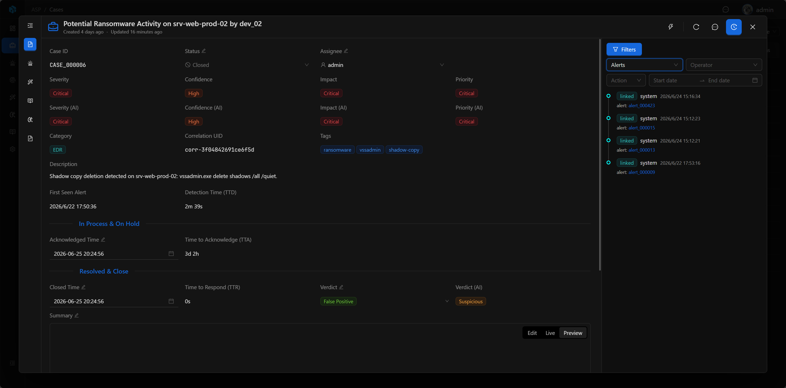

# Audit Log

Audit Log is used to track changes to important resources within the platform. It records who created, updated, or deleted what and when, as well as what specific fields or relationships changed.

Its focus is not on displaying resource details, but on providing a traceable change timeline to help users understand how data evolved step by step into its current state.

## Entry Point

Audit Log is opened via the `Log` button in the upper right corner of the resource detail page. Resources such as Case, Alert, Artifact, Enrichment, Playbook, and Knowledge can all view their own change timeline from the detail page.

## Recorded Content

| Content | Description |
|---------|-------------|
| Resource | The resource being operated on. |
| Action | Operation type, such as create, update, delete, linked, unlinked, deleted. |
| Operator | The operator. System automated actions display as system. |
| Time | When the operation occurred. |
| Changes | Field changes, including before and after modification values. |
| Relation | Resource relationship changes, such as linked or unlinked records. |
| Metadata | Additional information for saving relationships, tags, or supplementary context for deleted records. |

Currently, the timeline displays the most recent 100 records in reverse chronological order.

## Timeline View

Audit Log is displayed as a timeline. Each record contains operation type, operator, time, and change content, making it easy to quickly track the resource change process.

Field updates are displayed in `from → to` format; relationship changes show related resource types and readable labels. For associated resources that still exist, you can click to navigate directly to the corresponding detail page.

## Filters

When there are many records, you can quickly locate key information through filtering:

- Action: Filter by operation type.
- Operator: Filter by operator.
- Field: Filter by changed field.
- Time Range: Filter by time range.

## Deleted Records

When a resource is deleted, the audit log preserves readable labels in metadata to avoid only seeing UUIDs after deletion.

If the deleted object is a relationship object, a `deleted` relationship event will appear in the parent resource's timeline. Since the target object no longer exists,这类事件只展示可读标签，不提供跳转。

## Usage Recommendations

- View change history in resource details such as Case, Alert, and Artifact.
- When investigating misoperations, first check the operator and changes.
- When tracking relationship changes, pay attention to linked, unlinked, and deleted events.
- For deleted records, prioritize checking deletion labels in metadata.
