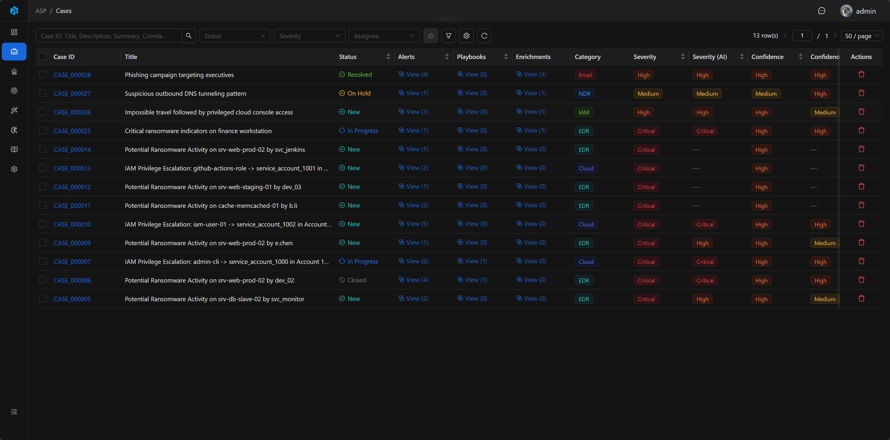
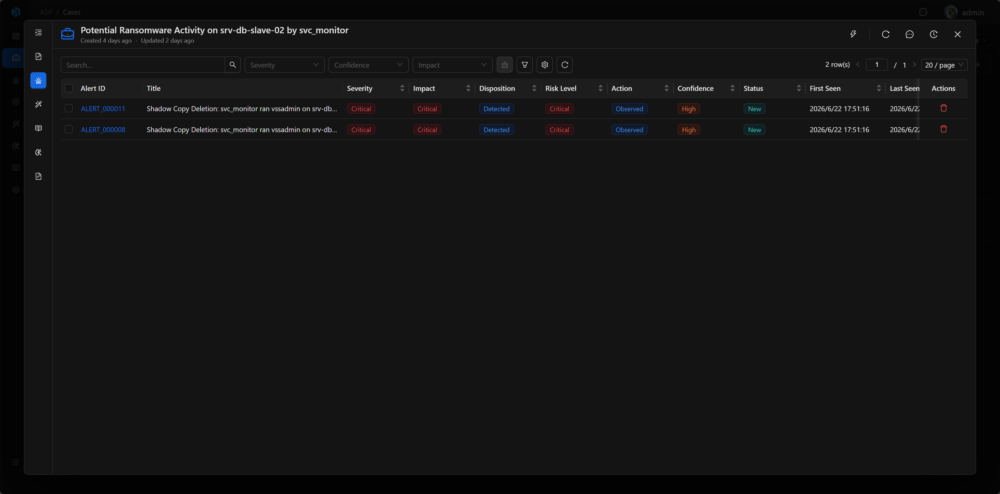
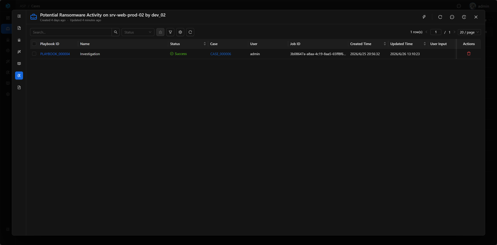
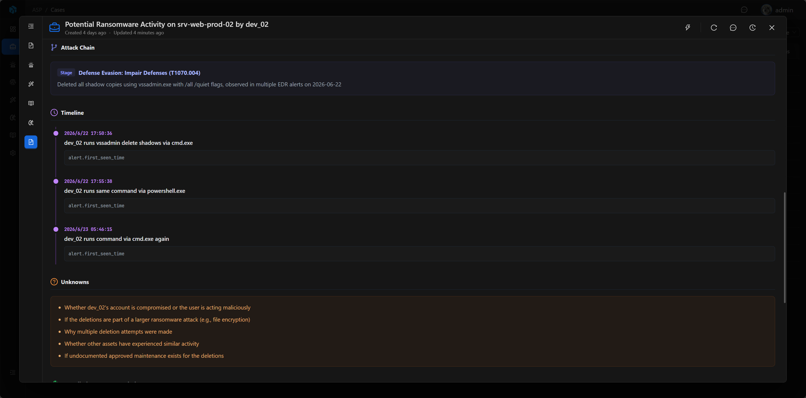
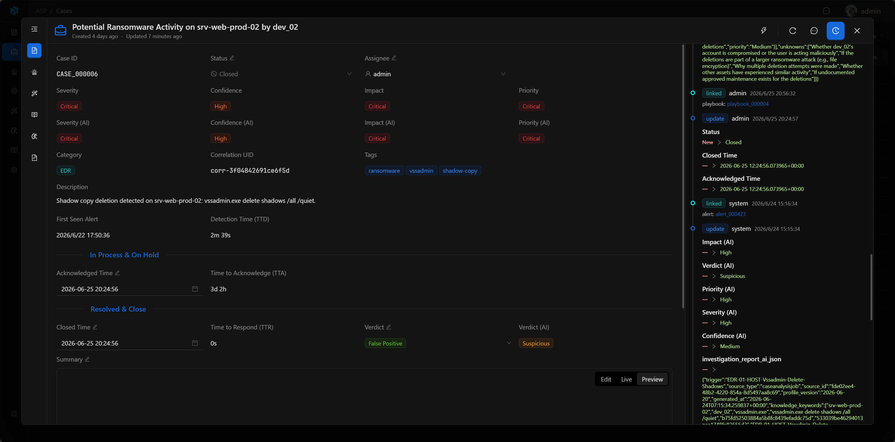

# Case

Case is the core disposition object in ASP and the war room for analyst collaborative investigation. A Case aggregates alerts, entities, enrichment, knowledge, playbooks, AI investigation reports, discussions, and timelines, allowing teams to complete judgment and response around the same security incident.

In ASP, Case is not just a ticket. Discussions, supplementary judgments, and attachments in Comments, as well as operation traces in Log / Timeline, all become important context for subsequent LLM analysis, report generation, and knowledge extraction.

## View

The Case list is used to centrally manage and track the security incident handling process. Analysts can filter and sort by status, severity, assignee, and other conditions to quickly find cases that need disposition.

## Key Fields

- Case ID: System-generated readable ID.
- Title: Case title.
- Status: New, In Progress, On Hold, Resolved, Closed.
- Severity / Confidence / Impact / Priority: Manual assessment.
- Severity (AI) / Confidence (AI) / Impact (AI) / Priority (AI): AI assessment.
- Verdict / Verdict (AI): Final disposition and AI disposition.
- Assignee: Person responsible.
- Summary: Closure summary.
- Correlation UID: Correlation ID.

## Basic

The Case detail page is the main interface of the case war room. The left side displays case basic information, associated evidence, automation results, and AI reports; the right side can open Comments or Log drawers to view collaborative discussions and timelines.

## Associated Evidence and Context

The Case detail page includes:

- Summary, Risk Assessment, Classification, Time, Ownership, Description.
- Alerts: Associated alerts.
- Enrichments: Associated enrichment results.
- Knowledge: Knowledge extracted from or associated with the case.
- Playbooks: Playbook tasks triggered from the case.
- Investigation: AI investigation report.

### Alerts

Alerts preserve all alerts associated with the Case. Analysts can enter Alert details from here to view detection rules, raw logs, Artifact, and Enrichment.

### Enrichments

Enrichments display external context associated with the Case, such as threat intelligence, assets, identity, history, etc., helping analysts quickly assess risk.

### Playbooks

Playbooks display automation tasks triggered from the current Case, including investigation, knowledge extraction, threat intelligence enrichment, and CMDB enrichment.

## Investigation

Investigation displays AI-generated investigation reports. The report references Case fields, associated Alerts, Artifact, Enrichment, Comments, and Log / Timeline to generate disposition, attack chain, key evidence, timeline, and response recommendations.

## Comments

Comments is the collaborative discussion area in the Case war room. Analysts can record judgments, supplement leads, reply to teammates, @mention members, and attach files.

These discussions are not ordinary notes. Case's LLM analysis reads Comments, so what analysts write here—confirmations, denials, exceptions, and disposition records—will influence subsequent AI reports and knowledge extraction.

## Log / Timeline

Log / Timeline displays the operation trace of the Case, including field changes, associated resource changes, operators, and occurrence times. It is not only for auditing but also for reconstructing the incident handling process.

Case's AI analysis references this timeline information to help generate more accurate reports and process reviews.

## Executing Playbook

Case is the primary trigger point for Playbooks. Analysts can select investigation, knowledge extraction, threat intelligence enrichment, or CMDB enrichment playbooks from the Case, and supplement natural language requirements through User Input.

After Playbook execution, a task record is generated, with status progressing from Pending, Running to Success or Failed. Execution results return to Case, Knowledge, or Enrichment to continue serving subsequent analysis and report generation.

## Common Operations

- Modify status, assignee, closure time, and closure summary.
- View associated Alert, Artifact, and Enrichment.
- Record analysis judgments, supplement leads, and team discussions in Comments.
- View Log / Timeline to reconstruct case handling process.
- Trigger Playbook from Case, and return to Case to review execution results.

## Next Steps

- [Alert](../alert/) — View how alerts provide detection context.
- [Artifact](../artifact/) — View how entities and IOC support investigation.
- [Playbook](../playbook/) — View how automation tasks are triggered from Case.
- [Audit Log](../audit-log/) — View more details about timelines and change records.
