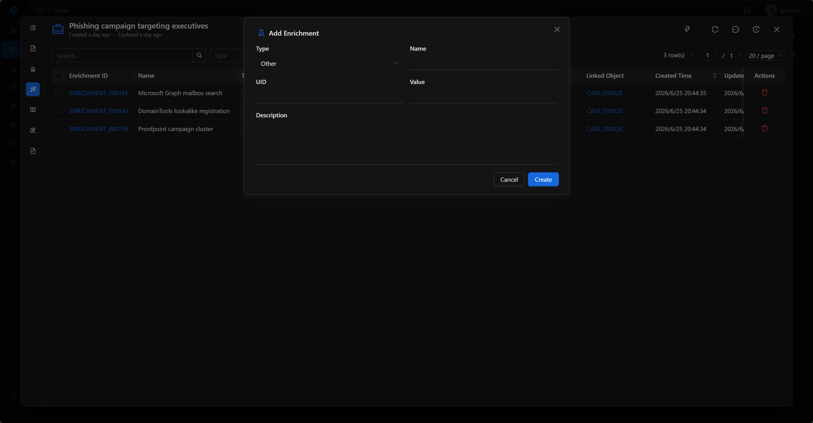

# Enrichment

Enrichment is external context attached to Case, Alert, or Artifact, used to store threat intelligence, assets, identity, history, SIEM query results, or analyst structured investigation findings.

## View

The Enrichment list is used to centrally view all enrichment records. The list displays Enrichment ID, Name, Type, Provider, Value, Linked Object, Created Time, Updated Time, Description, and UID.

The list supports quick filtering by Type and Provider, and also supports advanced filtering by Enrichment ID, Type, Provider, Name, UID, Value, Description, Created Time, and Updated Time to locate records.

## Key Fields

- Enrichment ID: System-generated readable ID.
- Name: Enrichment name.
- Type: Enrichment type, such as Threat Intelligence, Reputation, CMDB, Identity, History.
- Provider: Data source, such as AlienVaultOTX, Internal CMDB, MCP, Splunk, Elastic.
- UID: External stable identifier, used for deduplication.
- Value: Enrichment value.
- Desc: Summary.
- Data: Complete JSON data.

## Basic

Basic displays the core information of the enrichment record: Enrichment ID, Type, Provider, Linked Object, UID, Value, Description, and Data.

Linked Object indicates which Case, Alert, or Artifact the current Enrichment is attached to; clicking it returns to the corresponding resource to continue investigation. Data is used to store complete JSON, suitable for storing threat intelligence return values, asset details, identity context, or SIEM query results.

## Associated Targets

Enrichment can be associated with:

- Case
- Alert
- Artifact

One Enrichment is only associated with one target object. The detail pages of Case, Alert, and Artifact can all view their associated enrichment context through Enrichments.

## Add and Edit

Analysts can add new enrichment records in the Enrichments section of Case, Alert, or Artifact detail pages. Manually added records have Provider set to `MANUAL`, and you can fill in Type, Name, UID, Value, and Description.

The Enrichment detail page supports editing UID, Value, and Description, suitable for supplementing stable identifiers, key values, and summary descriptions during investigation.

## Usage Recommendations

- Attach IOC threat intelligence results to the corresponding Artifact.
- Attach asset, identity, CMDB, or history context to related Case, Alert, or Artifact.
- Save SIEM query results, manual judgments, and structured investigation findings as Enrichment, rather than leaving them only in temporary conversations or notes.
- Use UID to save external system stable identifiers for deduplication and source tracing.
