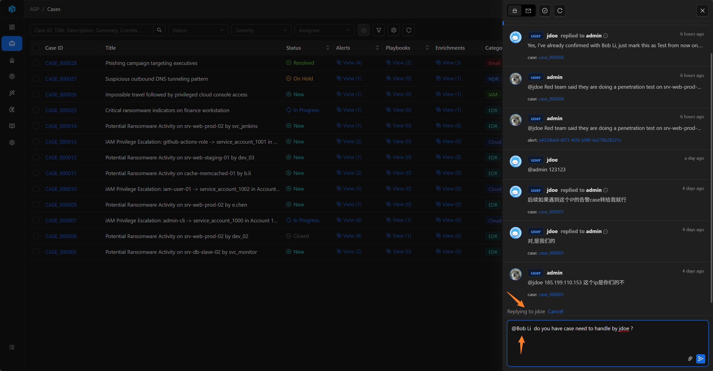

# Inbox

Inbox is ASP's in-app messaging capability, used to receive system notifications, user messages, and resource-related collaboration reminders.

## Entry and List

The message button at the top of the frontend displays the unread count; clicking it opens the Inbox Drawer.

Inbox supports viewing all messages or only unread messages, and also supports refreshing the list and Mark all read. Clicking a message loads the details and marks the current user's receipt status as read.

## Message Types

- System: System messages.
- User: User messages.

Each recipient has an independent read status, so the same message can have different read / unread status for different users.

## Message Content

Messages display sender, send time, message type, body, attachments, and associated resources. Image attachments can be previewed, and other files can be opened or downloaded.

If a message is associated with a resource, Inbox displays the resource type and resource label; clicking it opens the corresponding detail page to continue processing.

## Send and Reply

When sending a User message, you need to `@` at least one user in the body as a recipient, and you can also attach files or paste images.

User messages support replies; System messages cannot be replied to. Users can only delete their own User messages, and cannot delete System messages or messages from others.

## Associated Resources

Inbox messages can be associated with the following resources:

- Case
- Alert
- Artifact
- Enrichment
- Playbook
- Knowledge
- User

`@` mentioning users in Comments generates Inbox messages and associates the current resource. When users reply from such messages, the reply content is also synchronized back to the corresponding resource's Comments.

## Common Uses

- Notify users to follow a Case, Alert, or Artifact.
- Send system processing results.
- Conduct lightweight collaboration around security resources.
- Enter the corresponding resource from @ mentions in Comments to continue processing.
