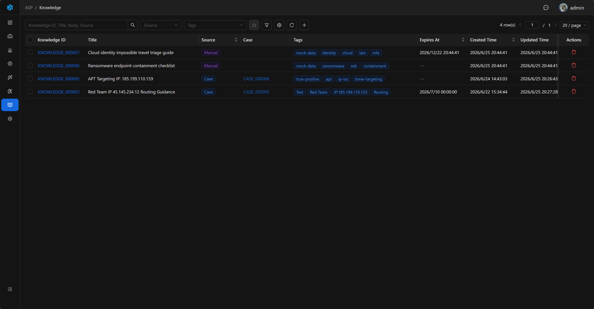

# Knowledge

Knowledge is used to accumulate reusable security experience, allowing teams to save disposition conclusions, false positive judgments, investigation steps, and IOC assessment experience as searchable, reusable knowledge.

## View

The Knowledge list is used to centrally manage knowledge entries. The list displays Knowledge ID, Title, Source, Case, Tags, Expires At, Created Time, Updated Time, and Body.

The list supports quick filtering by Source and Tags, and also supports advanced filtering by Knowledge ID, Source, Tags, Title, Body, Expires At, Created Time, and Updated Time to locate records.

## Sources

Currently supports two types of sources:

| Source | Description |
|--------|-------------|
| Manual | Manually created knowledge. |
| Case | Knowledge extracted from Case. |

Case-sourced Knowledge must be associated with a Case; Manual-sourced Knowledge is not associated with a Case. One Case corresponds to at most one extracted Knowledge.

## Key Fields

- Knowledge ID: System-generated readable ID.
- Title: Title.
- Body: Body, supports Markdown.
- Source: Source.
- Tags: Tags.
- Expires At: Expiration time, empty means long-term valid; after expiration, it no longer participates in knowledge search and AI Agent retrieval.

## Basic

Basic displays the core information of the knowledge entry: Knowledge ID, Source, Case, Expires At, Title, Tags, and Body.

Case-sourced Knowledge displays the source Case; clicking it returns to the corresponding Case to view investigation context. Body uses Markdown display, suitable for saving structured analysis steps, judgment basis, and response recommendations.

## Add and Edit

Analysts can manually add new knowledge in the Knowledge list, filling in Title, Expires At, Tags, and Body. Manually created knowledge has Source set to `Manual`.

The detail page supports editing Title, Expires At, Tags, and Body. Case-sourced Knowledge is typically generated by the `Knowledge Extraction` Playbook, and content can also be further organized on the detail page.

## Knowledge Extraction

The `Knowledge Extraction` Playbook extracts reusable knowledge from Cases that already have an analyst verdict. During execution, it reads the Case investigation context, generates title, body, and tags, and saves it as Knowledge with Source set to `Case`.

If the Case has no verdict, the Playbook skips extraction to avoid accumulating unconfirmed investigation processes as organizational knowledge.

## Usage Recommendations

- Write recurring disposition experience into Knowledge.
- After closing key Cases, extract knowledge through Playbook.
- Accumulate false positive judgments, investigation steps, IOC assessment experience, and response recommendations as searchable content.
- Use Tags to categorize by attack type, business system, data source, or response action.
- Set Expires At for short-term valid intelligence or temporary disposition experience.
- Reference similar experience in subsequent investigations.
