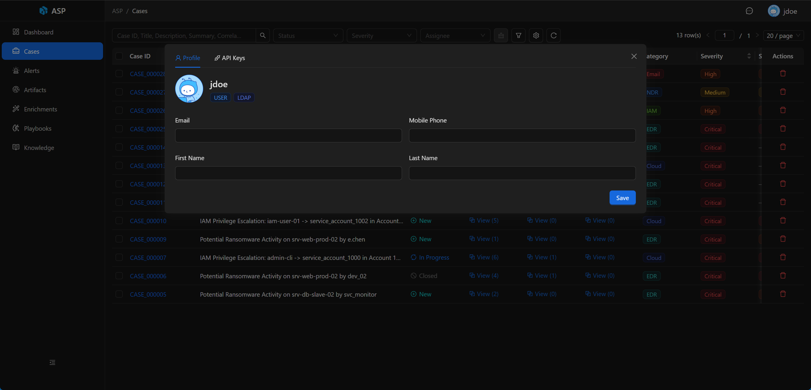

# Personal Center

Personal Center is used for the currently logged-in user to maintain their profile, personal settings, password, and API Key.

## Entry

Click the user menu in the upper right corner of the frontend to open Personal Center. All logged-in users can enter Personal Center.



## Profile

Profile is used to maintain the current user's personal information:

- Avatar
- Email
- First Name
- Last Name
- Mobile Phone

These fields only affect the current user's profile and do not change user roles or authentication types.

## Settings

Settings is used to maintain personal preferences for the current user. It currently includes Notification Preferences:

- Notify me when my Playbook runs finish: when enabled, the user who triggered a Playbook receives an Inbox system notification after the run finishes. Both success and failure are notified.
- Notify me when a Case is assigned to me: when enabled, the user receives an Inbox system notification when a Case is assigned to them.

Notification preferences are enabled by default. Turning them off only affects the current user and does not affect notifications received by other users.

Case assignment notifications are sent only to the new assignee. Unassignment, saving the same assignee again, and assigning a Case to yourself do not send notifications.


## Password

Local Password users can change their password in Personal Center. LDAP users log in with LDAP password, so the local password change page is not displayed.


## API Keys

API Key is used for external scripts, tools, or Agents to call ASP API. Each user can only manage their own API Key.

API Key supports:

- Name: Key name.
- Key: Key value starting with `asp_`.
- Expires At: Expiration time, empty means no expiration.
- Last Used: Last used time.
- Refresh: Refresh key value.
- Delete: Delete key.


When using API Key to call interfaces, add to the request header:

```http
Authorization: Api-Key <key>
```

Expired API Keys cannot continue to be used; if a user is disabled, that user's API Keys also cannot pass authentication.

The API Key interface is located at `/api/auth/api-keys/`.
