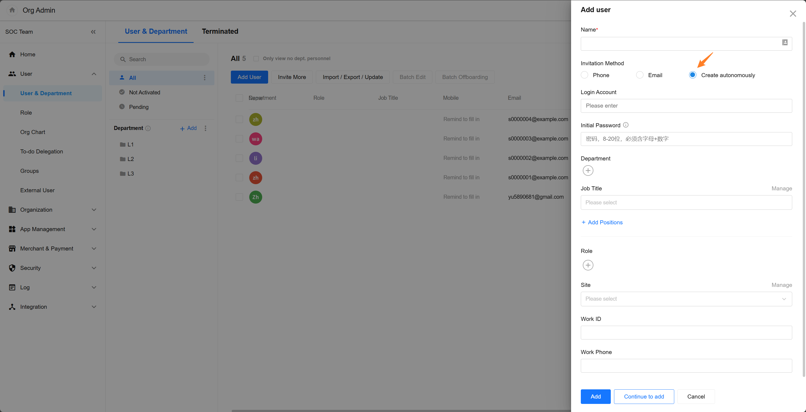

# Application Configuration

## Role Management

SIRP includes three built-in roles: `Administrator`, `Security Analyst`, and `Observer`. Users can create custom roles and assign permissions based on actual needs.

- Administrator

Has full system permissions

- Security Analyst

Has data view and operation permissions, but no system configuration permissions. This role is suitable for daily analysts and incident responders.

- Observer

Has data view permissions only. This role is suitable for management and auditors.

## Account Management

### Adding Accounts

Administrators can add new user accounts through `Organization Management` > `Users and Departments`.

After users join the organization, they can be assigned to different roles in SIRP.

