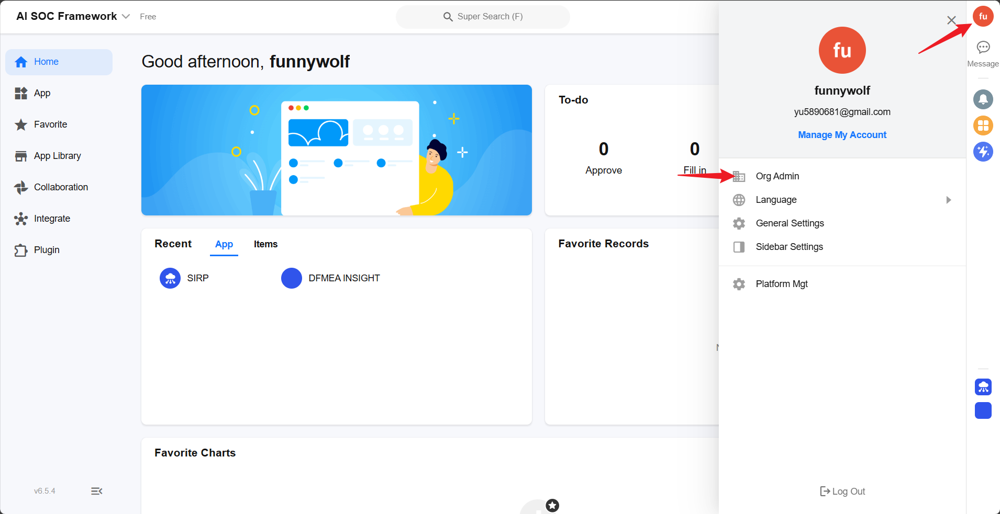
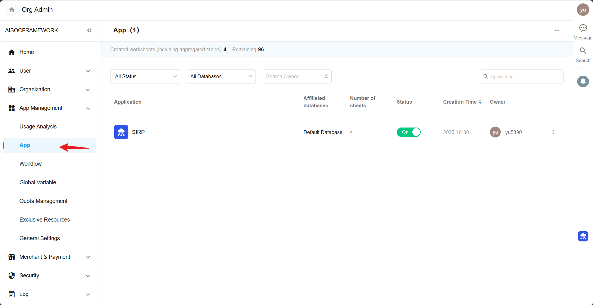
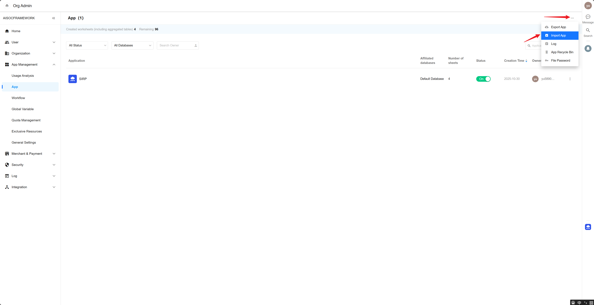
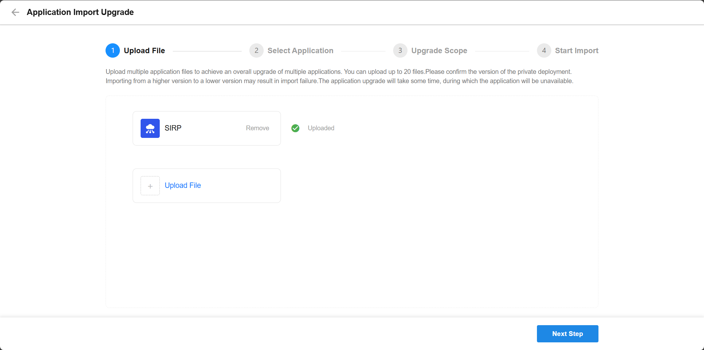
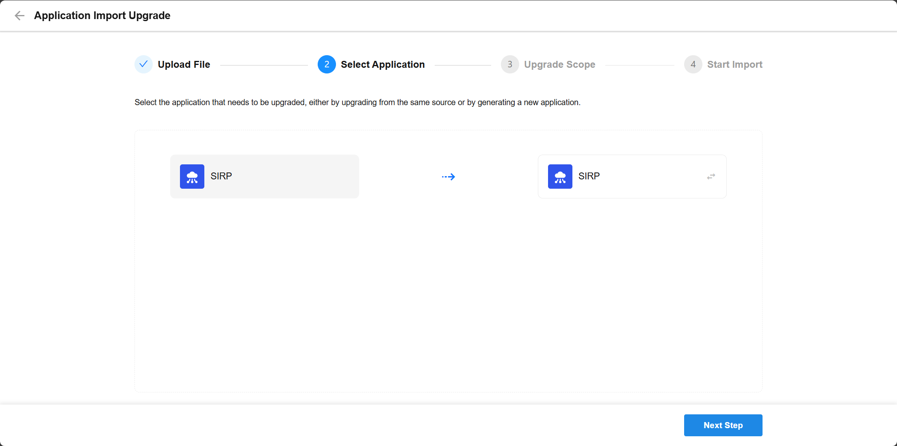
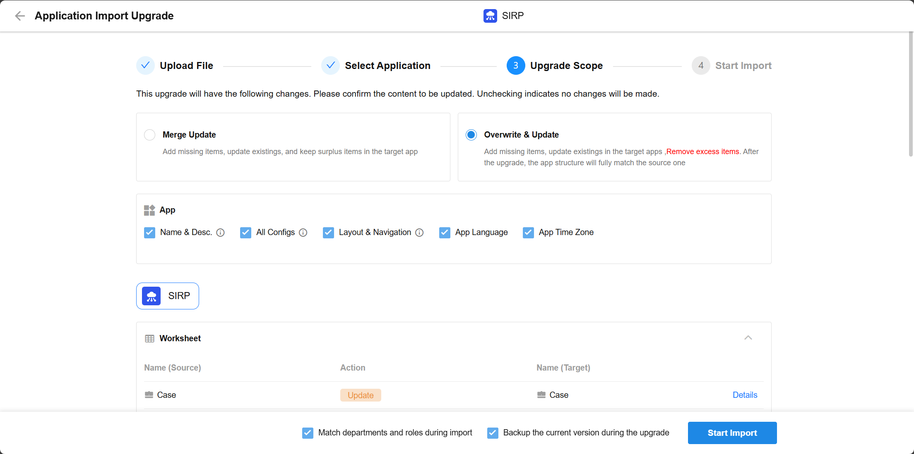
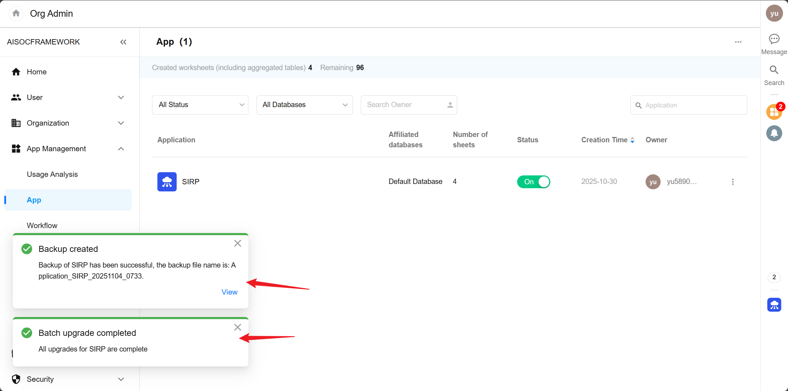

# SIRP 安装

- **假设 Linux 服务器 IP : 192.168.241.128**
- **假设 Windows 11 开发主机 IP : 192.168.241.1**

## 安装 Nocoly

[安装手册](https://docs-pd.nocoly.com/deployment/docker-compose/standalone/quickstart/)

## 导入 SIRP

- 克隆 ASF 代码库 , SIRP应用文件为 ai-soc-framework/PLUGINS/SIRP/SIRP.mdy

```bash
git clone git@github.com:FunnyWolf/ai-soc-framework.git
```

- 登录 Nocoly 平台选择`组织管理` `应用`





- 导入 SIRP.mdy











