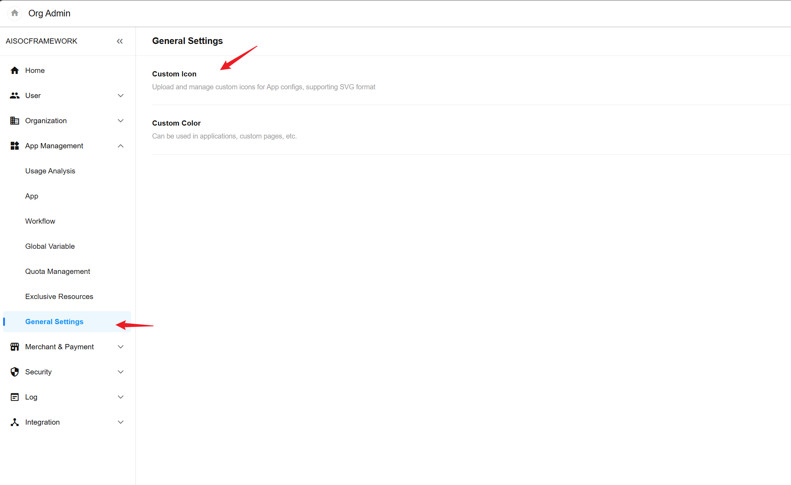

# System Configuration

## Custom Icons



## Webhook for Receiving Emails

Functions such as `Reset Password` and `Invite External Users` in SIRP rely on email sending. Users can configure a Webhook to receive these emails.

For configuration method, refer to [Custom Integration Webhook for Receiving Emails](https://docs-pd.nocoly.com/faq/email#self-integration).

Content of the `appextensions.json` file. Replace 192.168.241.1:7000 with the ASF deployment server IP and port.

```json
{
  "WebhookUrl": "http://192.168.241.1:7000/api/v1/webhook/nocolymail",
  "WebhookHeaders": {}
}
```

ASF logs will print the email content.