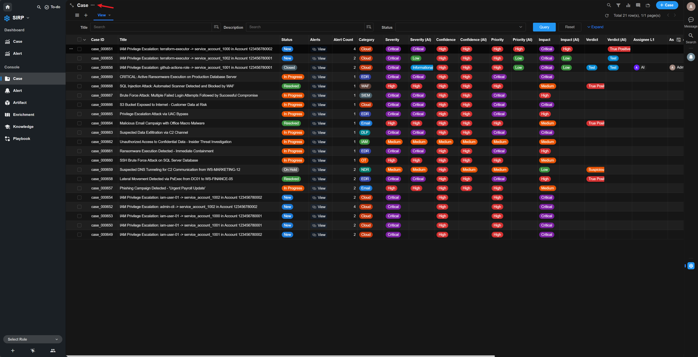
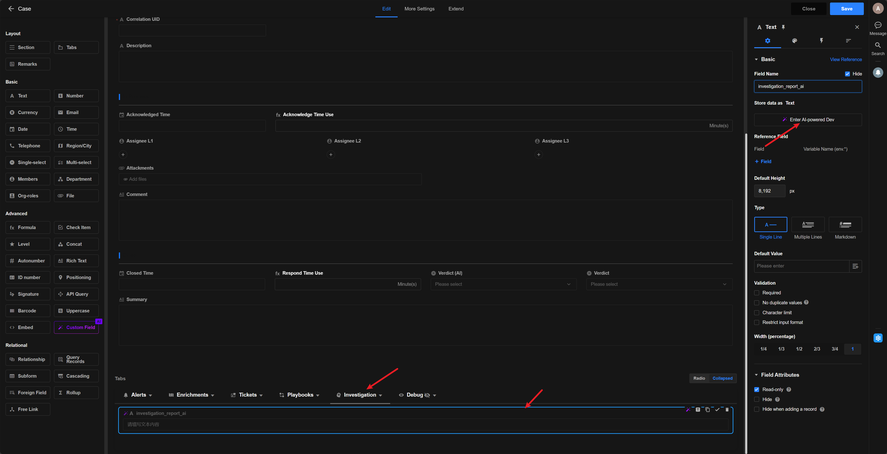
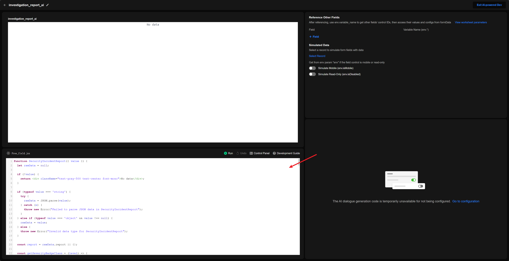

# Update Custom Components

SIRP uses custom React components to extend UI capabilities. Component code is located in `agentic-soc-platform/PLUGINS/SIRP/components/`.

## Component Types

| Type | Description | Props |
|------|-------------|-------|
| Storage | Can store user input values | `value`, `onChange`, `env` |
| Reference | Display existing data only, cannot store | `formData`, `env`, `currentControl` |

## Available Components

| Component File | Description | Type |
|----------------|-------------|------|
| `investigation_report_ai.jsx` | AI Investigation Report (Light) | Reference |
| `investigation_report_ai_dark.jsx` | AI Investigation Report (Dark) | Reference |
| `json.jsx` | JSON Viewer (Light) | Reference |
| `json_dark.jsx` | JSON Viewer (Dark) | Reference |

Dark mode components use `_dark.jsx` suffix for system dark theme.

## Development Guidelines

**Architecture**

- Single function component only, no `import` statements allowed
- React built-ins (`useState`, `useEffect`, etc.) are globally available

**Styling**

- Tailwind CSS only
- Use `<LucideIcon name="IconName" size="16" />` for icons (PascalCase)
- Outer container must not include margins (`p-*`, `m-*`) or borders (`border`, `shadow`)

**Error Handling**

- Throw `new Error("...")` on data parse failure, no error UI rendering
- No `console.log` or comments in code

## Update Process

> Select component to edit

> Paste JSX code and save
