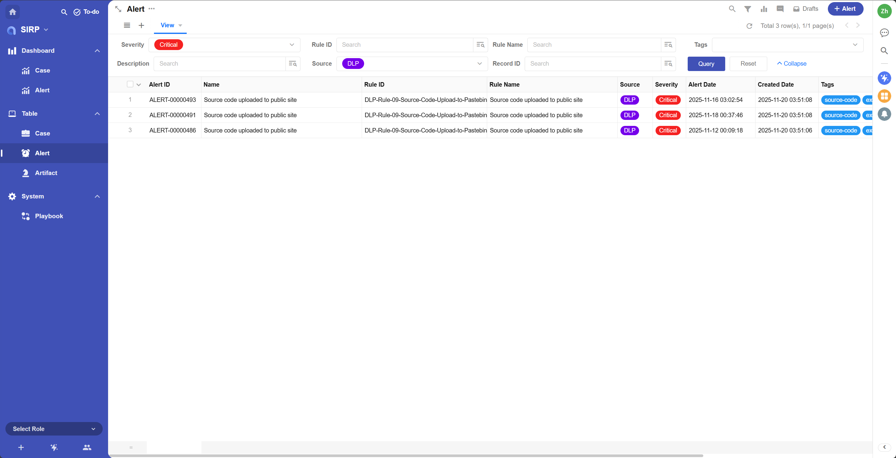
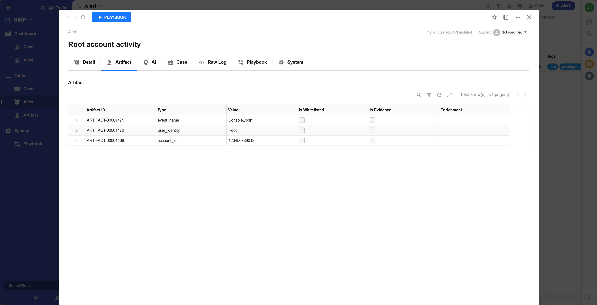
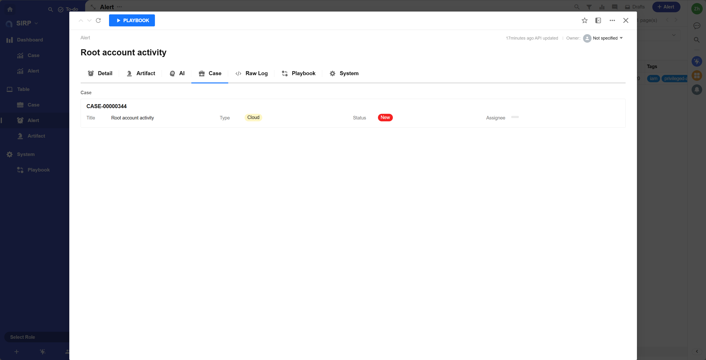
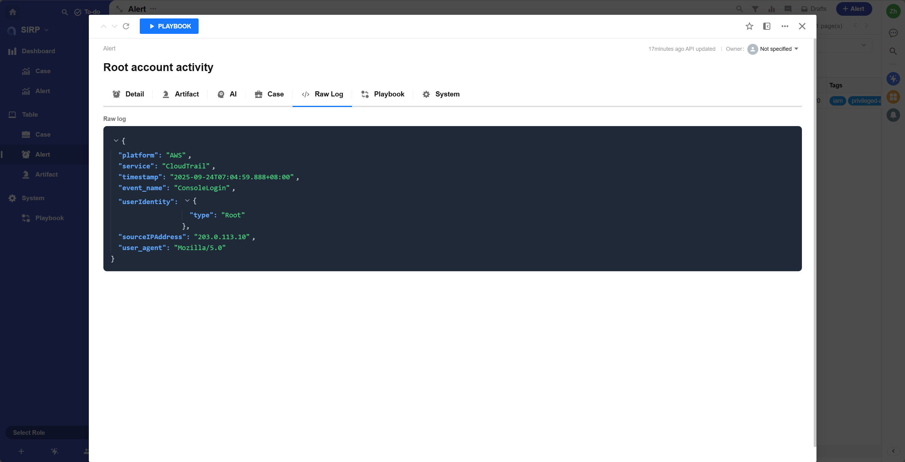
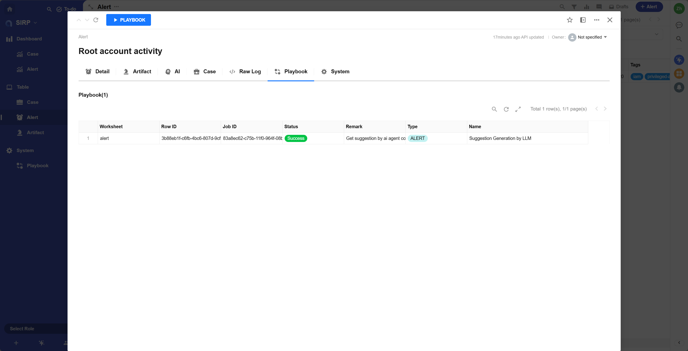

# Alert

- 集中展示所有告警记录.
- 默认告警中所有字段为只读,不可编辑.
- 分析员不会修改告警数据,只会基于告警数据进行调查和响应工作.

## View

支持多种筛选和排序功能.

## Detail

> Alert 操作面板

- Name

人类可读的告警名称,简要描述告警内容

- Reference

告警的参考链接,通常指向相关的威胁情报或原始 SIEM 原始数据链接或安全设备告警链接

- Source Data Identifier

元数据,用于唯一标识告警的来源数据,例如日志ID,事件ID等,通常用于在 SIEM 和安全设备中快速定位告警的原始数据

- Severity

告警严重性等级,分为 `Low` `Medium` `High` `Critical` 四个等级.

- Source

告警来源,分为 `NDR` `EDR` `DLP` 等等类型.

- Alert Date

原始告警发生时间.

- Created Date

告警在系统中创建时间.

- Tags

Alert 标签,用于对 Alert 进行分类和标记.可用于搜索和过滤.

- Alert ID

自动生成的唯一告警编号.只用于可读性显示,不作为唯一标识.

- Description

Alert 的详细描述.支持 Markdown 格式.

- Attachments

告警相关的附件.

- **Rule ID**

根据 ASF 的设计理念,告警都由 SIEM 中规则 (Rule) 来创建. Rule ID == Module 脚本名称 == SIEM 中 Rule 名称.

> 对于 Splunk Rule ID 其实就是 Splunk 中 Alert 名称, 对于 Kibana 其实就是 Rule name 可以参考 [SIEM 集成](../../../asf/production/siem/)

- Rule Name

Rule 的人类可读名称.用于生成 Case Title.

## Artifact

告警相关的 Artifact 列表.

## AI

基于告警内容生成的 AI 分析结果.

## Case

与告警相关联的 Case.

## Raw Log

告警的原始日志内容.JSON 格式.

## Playbook

告警相关的 Playbook 执行历史.

## System

告警的系统字段.